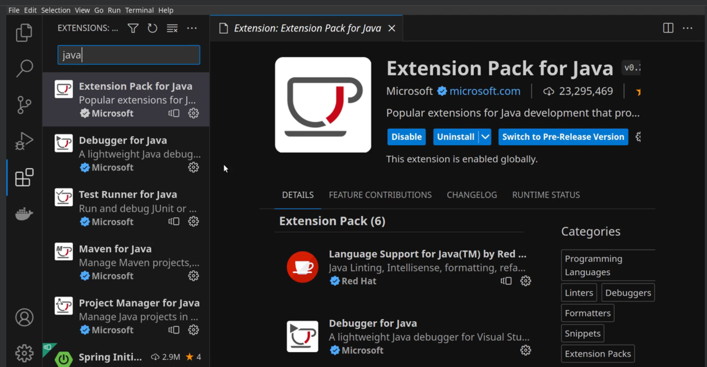
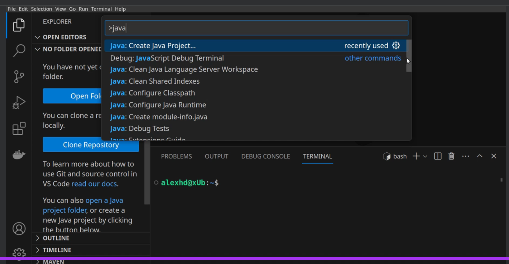

= IDE
:toc: right
:toclevels: 5
:sectnums

== Visual Studio Code - Java Development

* Prepare VS Code for Java Development
* Code Assistance
* Debug Java Code
* Code Assistance and Refactoring
* VS Code Plugins
** Extension Pack for Java

---

* VS Code Command Palette
** Command + P / Control + Shift + P
** >java

---

* intellCode
* code snippet