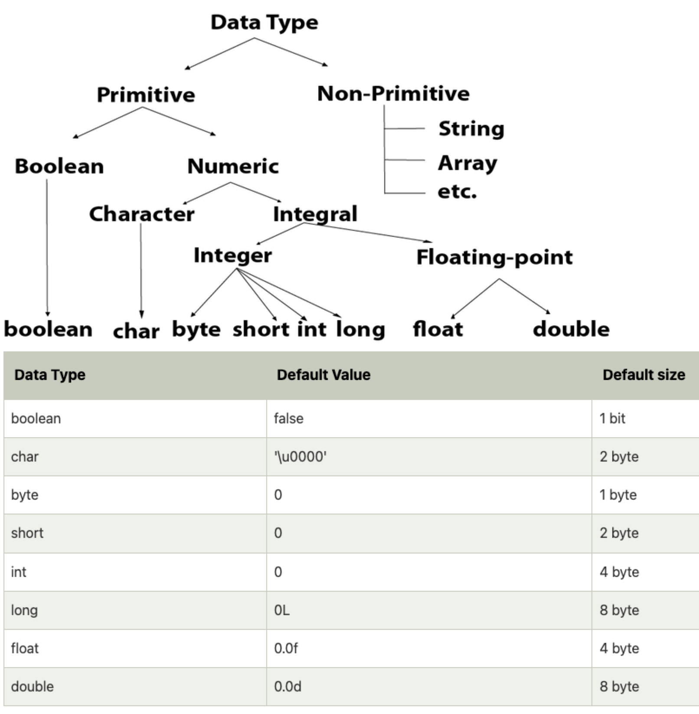

= Core Java - Automation Architect
:toc: right
:toclevels: 5
:sectnums: 5

##############################################

== Path Environment Variable

The `PATH` environment variable in Java (and more broadly in any operating system) is a system variable used to specify the directories in which executable programs are located. When you run a command in the terminal or command prompt, the operating system searches through these directories to find the executable file corresponding to the command.

*Importance of `PATH` in Java*

When working with Java, the `PATH` environment variable is crucial because it allows the system to locate the Java Development Kit (JDK) executables, such as `java` (the Java runtime) and `javac` (the Java compiler). By setting the `PATH` variable to include the directory where the JDK binaries are located, you can run Java commands from any command line prompt without needing to specify the full path to the executable.

*Setting the `PATH` Environment Variable*

*On Windows:*
1. *Locate JDK Installation Directory*:
- Typically, it is something like `C:\Program Files\Java\jdk-17\bin`.

2. *Set the PATH variable*:
- Open the *Start Menu* and search for `Environment Variables`.
- Click on *Edit the system environment variables*.
- In the System Properties window, click on the *Environment Variables* button.
- In the Environment Variables window, under *System variables*, find the `Path` variable and select it. Click on *Edit*.
- In the Edit Environment Variable dialog, click on *New* and add the path to the JDK `bin` directory (e.g., `C:\Program Files\Java\jdk-17\bin`).
- Click *OK* to close all dialog boxes.

---

*On macOS/Linux:*

1. *Locate JDK Installation Directory*:
- Typically, it is something like `/Library/Java/JavaVirtualMachines/jdk-17.jdk/Contents/Home/bin` on macOS or `/usr/lib/jvm/java-17-openjdk-amd64/bin` on Linux.

2. *Set the PATH variable*:
- Open a terminal.
- Open the `.bash_profile`, `.bashrc`, `.zshrc`, or `.profile` file in a text editor (depending on your shell and system configuration):
```sh
nano ~/.bash_profile
```
- Add the following line to set the PATH variable:
```sh
export PATH=$PATH:/Library/Java/JavaVirtualMachines/jdk-17.jdk/Contents/Home/bin
# or for Linux
export PATH=$PATH:/usr/lib/jvm/java-17-openjdk-amd64/bin
```
- Save the file and exit the text editor.
- Apply the changes by running:
```sh
source ~/.bash_profile
```

---

*Verifying the PATH*

To verify that the PATH variable is set correctly, you can open a new terminal or command prompt and run:
----
java -version
javac -version
----
If the PATH is set correctly, these commands should display the installed Java version without any errors.

=== Question Set (JDK, JRE, ENV Variables)

1. *What does the PATH environment variable do?*
- A) Specifies the maximum memory allocation for the operating system.
- B) Stores the location of executables to be used from the command line.
- C) Defines the network configuration settings.
- D) Sets the default file permissions.

2. *What is the primary purpose of the CLASSPATH environment variable in Java?*
- A) To specify the maximum heap size for Java applications.
- B) To locate the Java Development Kit (JDK).
- C) To locate the classes and libraries required by Java programs.
- D) To store the user’s personal settings for Java applications.

3. *Which of the following statements about bytecode is correct?*
- A) Bytecode is the machine code for the Java Virtual Machine (JVM).
- B) Bytecode is the source code written by the programmer.
- C) Bytecode is the binary code executed directly by the operating system.
- D) Bytecode is used only for JavaScript programs.

4. *What is included in the Java Development Kit (JDK)?*
- A) Only the Java Runtime Environment (JRE).
- B) The JRE, development tools, and libraries for Java development.
- C) Only the Java Virtual Machine (JVM).
- D) Only the Java API documentation.

5. *What is the role of the Java Runtime Environment (JRE)?*
- A) To compile Java source code into bytecode.
- B) To provide libraries, Java Virtual Machine (JVM), and other components to run Java applications.
- C) To develop and debug Java applications.
- D) To edit Java source code files.

##############################################

== Data Types in Java


---

*Primitive Data Types*

1. *byte*:
- Example: `byte b = 100;`
- Range: -128 to 127

2. *short*:
- Example: `short s = 10000;`
- Range: -32,768 to 32,767

3. *int*:
- Example: `int i = 100000;`
- Range: -2^31 to 2^31-1

4. *long*:
- Example: `long l = 100000L;`
- Range: -2^63 to 2^63-1

5. *float*:
- Example: `float f = 234.5f;`
- Range: Approximately ±3.40282347E+38F (6-7 significant decimal digits)

6. *double*:
- Example: `double d = 123.4;`
- Range: Approximately ±1.79769313486231570E+308 (15 significant decimal digits)

7. *char*:
- Example: `char c = 'A';`
- Range: 0 to 65,535 (unsigned)

8. *boolean*:
- Example: `boolean b = true;`
- Values: `true` or `false`

[source, java]
----
public class PrimitiveDataTypes {
    public static void main(String[] args) {
        // byte example
        byte byteVar = 100;
        System.out.println("byte value: " + byteVar);

        // short example
        short shortVar = 10000;
        System.out.println("short value: " + shortVar);

        // int example
        int intVar = 100000;
        System.out.println("int value: " + intVar);

        // long example
        long longVar = 100000L;
        System.out.println("long value: " + longVar);

        // float example
        float floatVar = 234.5f;
        System.out.println("float value: " + floatVar);

        // double example
        double doubleVar = 123.4;
        System.out.println("double value: " + doubleVar);

        // char example
        char charVar = 'A';
        System.out.println("char value: " + charVar);

        // boolean example
        boolean booleanVar = true;
        System.out.println("boolean value: " + booleanVar);
    }
}

----


== Unicode

[source, java]
----
public class UnicodeExample {
    public static void main(String[] args) {
        // Initializing Unicode characters using their code points
        char letterA = '\u0041'; // Unicode for 'A'
        char letterB = '\u0042'; // Unicode for 'B'
        char smileyFace = '\u263A'; // Unicode for '☺'

        // Printing Unicode characters
        System.out.println("Unicode Character \\u0041: " + letterA);
        System.out.println("Unicode Character \\u0042: " + letterB);
        System.out.println("Unicode Character \\u263A: " + smileyFace);

        // Printing Unicode code points
        System.out.println("Code Point of " + letterA + ": " + (int) letterA);
        System.out.println("Code Point of " + letterB + ": " + (int) letterB);
        System.out.println("Code Point of " + smileyFace + ": " + (int) smileyFace);

        // Using Unicode characters in strings
        String greeting = "Hello " + letterA + letterB + smileyFace + "!";
        System.out.println(greeting);

        // Unicode characters in a loop
        System.out.println("Looping through Unicode characters:");
        for (char ch = '\u0041'; ch <= '\u0045'; ch++) {
            System.out.println("Unicode Character: " + ch + " Code Point: " + (int) ch);
        }
    }
}

----

---

*Non-Primitive Data Types*

1. *String*:
- Example: `String str = "Hello, World!";`
- Strings are sequences of characters.

2. *Array*:
- Example: `int[] arr = {1, 2, 3, 4, 5};`
- Arrays can hold multiple values of the same type.

3. *Class*:

4. *Interface*:

5. *Enum*:

== Variables in Java

In Java, a variable is a container that holds data that can be changed during the execution of a program. Variables are fundamental to Java programming and are used to store information that your Java program manipulates. Each variable in Java has a specific type, which determines the size and layout of the variable's memory, the range of values that can be stored within that memory, and the set of operations that can be applied to the variable.

*Types of Variables in Java*

1. *Local Variables*:
- Declared inside a method, constructor, or block.
- Scope is limited to the block in which they are declared.
- Must be initialized before use.

2. *Instance Variables* (Non-static Fields):
- Declared inside a class but outside any method.
- Each instance of the class has its own copy of the variable.
- Initialized to default values if not explicitly initialized.

3. *Class Variables* (Static Fields):
- Declared with the `static` keyword inside a class but outside any method.
- Shared among all instances of the class.
- Initialized to default values if not explicitly initialized.


Here is an example illustrating different types of variables:

[source, java]
----
public class VariablesExample {
    // Instance variable
    int instanceVar;

    // Class variable (static variable)
    static int staticVar;

    public void methodExample() {
        // Local variable
        int localVar = 10;

        System.out.println("Local variable: " + localVar);
        System.out.println("Instance variable: " + instanceVar);
        System.out.println("Static variable: " + staticVar);
    }

    public static void main(String[] args) {
        // Create an instance of VariablesExample
        VariablesExample example = new VariablesExample();

        // Access instance variable
        example.instanceVar = 5;

        // Access static variable
        VariablesExample.staticVar = 20;

        // Call method to demonstrate local variable
        example.methodExample();
    }
}
----

##############################################

== Operators in Java

In Java, operators are special symbols that perform specific operations on one, two, or three operands, and then return a result. Here are the different types of operators in Java:

*1. Arithmetic Operators*

Used for performing basic arithmetic operations.

[source,java]
----
public class ArithmeticOperatorsDemo {
    public static void main(String[] args) {
        // Define variables
        int a = 15;
        int b = 4;

        // Addition
        int addition = a + b;
        System.out.println("Addition: " + a + " + " + b + " = " + addition);

        // Subtraction
        int subtraction = a - b;
        System.out.println("Subtraction: " + a + " - " + b + " = " + subtraction);

        // Multiplication
        int multiplication = a * b;
        System.out.println("Multiplication: " + a + " * " + b + " = " + multiplication);

        // Division
        int division = a / b;
        System.out.println("Division: " + a + " / " + b + " = " + division);

        // Modulus
        int modulus = a % b;
        System.out.println("Modulus: " + a + " % " + b + " = " + modulus);

        // Handling division by zero
        int zeroDivisor = 0;
        try {
            int result = a / zeroDivisor;
            System.out.println("Division by zero: " + result);
        } catch (ArithmeticException e) {
            System.out.println("Error: Division by zero is not allowed.");
        }
    }
}
----

################################################################################

---

*2. Unary Operators*

Used with only one operand.

[source,java]
----
public class UnaryOperatorsDemo {
    public static void main(String[] args) {
        // Initialize variables
        int a = 10;
        int b = -5;
        boolean flag = true;

        // Unary Plus
        int unaryPlus = +a;
        System.out.println("Unary Plus: " + unaryPlus);

        // Unary Minus
        int unaryMinus = -b;
        System.out.println("Unary Minus: " + unaryMinus);

        // Increment (Pre and Post)
        System.out.println("Pre-Increment: " + (++a));
        System.out.println("Post-Increment: " + (a++));

        // Decrement (Pre and Post)
        System.out.println("Pre-Decrement: " + (--b));
        System.out.println("Post-Decrement: " + (b--));

        // Logical NOT
        boolean notFlag = !flag;
        System.out.println("Logical NOT: " + notFlag);
    }
}

----

################################################################################

---

*3. Assignment Operators*
Used to assign values to variables.

[source,java]
----
public class AssignmentOperatorsDemo {
    public static void main(String[] args) {
        int a = 10;
        int b = 5;

        // Simple assignment
        int c = a;
        System.out.println("Simple assignment: c = " + c);

        // Addition assignment
        c += b;
        System.out.println("Addition assignment: c += b -> c = " + c);

        // Subtraction assignment
        c -= b;
        System.out.println("Subtraction assignment: c -= b -> c = " + c);

        // Multiplication assignment
        c *= b;
        System.out.println("Multiplication assignment: c *= b -> c = " + c);

        // Division assignment
        c /= b;
        System.out.println("Division assignment: c /= b -> c = " + c);

        // Modulus assignment
        c %= b;
        System.out.println("Modulus assignment: c %= b -> c = " + c);
    }
}

----


################################################################################

---

*4. Relational Operators*
Used to compare two values.

[source,java]
----
public class RelationalOperatorsDemo {
    public static void main(String[] args) {
        int a = 10;
        int b = 5;
        int c = 10;

        // Equal to
        System.out.println("a == b: " + (a == b));
        System.out.println("a == c: " + (a == c));

        // Not equal to
        System.out.println("a != b: " + (a != b));
        System.out.println("a != c: " + (a != c));

        // Greater than
        System.out.println("a > b: " + (a > b));
        System.out.println("a > c: " + (a > c));

        // Less than
        System.out.println("a < b: " + (a < b));
        System.out.println("a < c: " + (a < c));

        // Greater than or equal to
        System.out.println("a >= b: " + (a >= b));
        System.out.println("a >= c: " + (a >= c));

        // Less than or equal to
        System.out.println("a <= b: " + (a <= b));
        System.out.println("a <= c: " + (a <= c));
    }
}

----


################################################################################

---

*5. Logical Operators*
Used to perform logical operations on boolean expressions.


[source,java]
----
public class LogicalOperatorsDemo {
    public static void main(String[] args) {
        boolean a = true;
        boolean b = false;

        // Logical AND
        System.out.println("a && b: " + (a && b));

        // Logical OR
        System.out.println("a || b: " + (a || b));

        // Logical NOT
        System.out.println("!a: " + (!a));
        System.out.println("!b: " + (!b));
    }
}
----


################################################################################

---

*6. Ternary Operator*
Also known as the conditional operator, it is used to decide which value to assign to a variable based on a boolean condition.

[source,java]
----
public class TernaryOperatorDemo {
    public static void main(String[] args) {
        int a = 10;
        int b = 5;

        // Ternary operator
        int max = (a > b) ? a : b;
        System.out.println("Max of a and b: " + max);

        int min = (a < b) ? a : b;
        System.out.println("Min of a and b: " + min);

        boolean isEqual = (a == b) ? true : false;
        System.out.println("a equals b: " + isEqual);
    }
}

----


=== Question Set (Data Types, Variables)


*Question 1: Java Data Types*

*Which of the following is not a primitive data type in Java?*

A. int

B. boolean

C. String

D. char

.Click Here For Answer
[%collapsible]
====
*The answer is* `C`
====

*Question 2: Unicode in Java*

*What is the range of Unicode values in Java?*

A. 0 to 65535

B. 0 to 32767

C. 0 to 2147483647

D. 0 to 1114111

.Click Here For Answer
[%collapsible]
====
*The answer is* `A`
====

*Question 3: Variables in Java*

*Which of the following statements is correct about variable declaration and initialization in Java?*

A. int a; a = 5;

B. int a = 5;

C. a = 5; int a;

D. Both A and B

.Click Here For Answer
[%collapsible]
====
*The answer is* `D`
====

*Question 4: Operators in Java*

*What will be the output of the following code?*

[source,java]
----

public class p2.Main {
    public static void main(String[] args) {
    int a = 10;
    int b = 5;
    System.out.println(a / b);
    }
}

----

A. 0

B. 2

C. 2.0

D. 10.0

.Click Here For Answer
[%collapsible]
====
*The answer is* `C`
====


*Question 5: Java Data Types*

*Which of the following statements is true about the `char` data type in Java?*

A. It is a 16-bit signed integer.

B. It is a 32-bit unsigned integer.

C. It is a 16-bit unsigned integer.

D. It is a 32-bit signed integer.

.Click Here For Answer
[%collapsible]
====
*The answer is* `C`
====

##############################################

=== Coding Exercise: Data Types and Variables

*Objective:*

The goal of this exercise is to test your understanding of Java data types, including both primitive and reference types, and your ability to work with variables.

*Problem Statement:*

1. *Primitive Data Types*
- Create a Java class named `PrimitiveDataTypes`.
- Declare variables of the following primitive data types: `int`, `double`, `char`, and `boolean`.
- Assign appropriate values to each variable.
- Write a method `displayPrimitives()` that prints the values of these variables to the console.

2. *Reference Data Types*
- Create a Java class named `ReferenceDataTypes`.
- Declare variables of the following reference data types: `String`, `Array`, and a custom class type `Person` (which you will define).
- Assign appropriate values to each variable.
- Write a method `displayReferences()` that prints the values of these variables to the console.

3. *Custom Class: Person*
- Create a custom class named `Person` with the following attributes: `name` (String), `age` (int).
- Include a constructor to initialize these attributes.
- Override the `toString()` method to provide a string representation of a `Person` object.

*Instructions:*

*Task:*

1. Implement the classes `PrimitiveDataTypes`, `Person`, and `ReferenceDataTypes` as described above.
2. Compile and run the `PrimitiveDataTypes` and `ReferenceDataTypes` classes to ensure they work as expected.
3. Ensure that all the values are printed correctly to the console.

---

This exercise will help you demonstrate your understanding of both primitive and reference data types in Java, along with basic object-oriented programming concepts.

##############################################

== If, Else

`if-else if` statements in Java are used to execute specific blocks of code based on multiple conditions. They are commonly used for:

1. *Decision Making:* To make decisions and perform actions based on different conditions.
2. *Validations:* To check and validate user inputs or data.
3. *Branching Logic:* To handle different scenarios in code execution, such as in algorithms or business logic.

[source,java]
----
public class p2.Main {
    public static void main(String[] args) {
        int number = 10;

        if (number > 0) {
            System.out.println("The number is positive.");
        } else if (number < 0) {
            System.out.println("The number is negative.");
        } else {
            System.out.println("The number is zero.");
        }
    }
}
----

== Switch Case

[source, java]
----
public class p2.Main {
    public static void main(String[] args) {
        int day = 3;
        String dayName;

        switch (day) {
            case 1:
                dayName = "Monday";
                break;
            case 2:
                dayName = "Tuesday";
                break;
            case 3:
                dayName = "Wednesday";
                break;
            case 4:
                dayName = "Thursday";
                break;
            case 5:
                dayName = "Friday";
                break;
            case 6:
                dayName = "Saturday";
                break;
            case 7:
                dayName = "Sunday";
                break;
            default:
                dayName = "Invalid day";
                break;
        }

        System.out.println("The day is: " + dayName);
    }
}

----

=== Switch Case V/s If Else

Choosing between `switch-case` and `if-else` in Java depends on the specific use case and the nature of the conditions you need to evaluate. Here are some guidelines to help decide when to use each:

*Use `switch-case` When:*

1. *Multiple Discrete Values:*
- You have a variable that you need to compare against several discrete constant values (e.g., integers, enums, characters, or strings).
- Example: Days of the week, menu options, or status codes.

2. *Readability and Maintainability:*
- The code becomes more readable and maintainable when dealing with many possible values.
- `switch-case` provides a cleaner and more organized structure for handling multiple branches.

3. *Performance:*
- `switch-case` can be more efficient than `if-else` when there are many branches because it can use a jump table for constant values, whereas `if-else` evaluates conditions sequentially.

*Use `if-else` When:*
1. *Range of Values:*
- You need to evaluate conditions based on ranges or complex logical expressions.
- Example: Checking if a number is within a certain range or combining multiple conditions.

2. *Boolean Conditions:*
- Your conditions are boolean expressions that do not compare against discrete constant values.
- Example: Checking conditions like `x > 10 && y < 5`.

3. *Complex Conditions:*
- You have complex conditions that cannot be simplified to discrete values.
- Example: Conditions involving multiple variables and logical operators.

*Examples:*


[source,java]
----
public class p2.Main {
    public static void main(String[] args) {
int option = 2;

switch (option) {
    case 1:
        System.out.println("Option 1 selected");
        break;
    case 2:
        System.out.println("Option 2 selected");
        break;
    case 3:
        System.out.println("Option 3 selected");
        break;
    default:
        System.out.println("Invalid option");
        break;
    }
}
}
----


[source,java]
----

public class p2.Main {
    public static void main(String[] args) {


int number = 45;

if (number > 0 && number <= 10) {
    System.out.println("Number is between 1 and 10");
} else if (number > 10 && number <= 20) {
    System.out.println("Number is between 11 and 20");
} else if (number > 20 && number <= 30) {
    System.out.println("Number is between 21 and 30");
} else {
    System.out.println("Number is out of range");
}
}
}
----

In summary, use `switch-case` for comparing a single variable against multiple constant values for better readability and potential performance benefits. Use `if-else` for complex conditions, ranges, or when boolean expressions are involved.


=== For, While and Do While Loop

== Java Loops

=== For Loop

[source, java]
----
public class p2.Main {
    public static void main(String[] args) {
        for (int i = 0; i < 5; i++) {
            System.out.println("i = " + i);
        }
    }
}
----

This code demonstrates a `for` loop in Java. It initializes an integer `i` to 0, checks if `i` is less than 5, and increments `i` by 1 after each iteration. The loop prints the value of `i` during each iteration.

=== While Loop

[source, java]
----
public class p2.Main {
    public static void main(String[] args) {
        int i = 0;
        while (i < 5) {
            System.out.println("i = " + i);
            i++;
        }
    }
}
----

This code demonstrates a `while` loop in Java. It initializes an integer `i` to 0 and continues looping as long as `i` is less than 5. The loop prints the value of `i` and then increments `i` by 1 during each iteration.

=== Do-While Loop

[source, java]
----
public class p2.Main {
    public static void main(String[] args) {
        int i = 0;
        do {
            System.out.println("i = " + i);
            i++;
        } while (i < 5);
    }
}
----

This code demonstrates a `do-while` loop in Java. It initializes an integer `i` to 0 and executes the loop body at least once, regardless of the condition. The loop prints the value of `i` and then increments `i` by 1. After the loop body, it checks if `i` is less than 5 before repeating.

##############################################


=== Coding Exercise: Conditional and Looping Statements

*Objective*

The goal of this exercise is to test your understanding of Java conditional statements (`if-else`, `switch`) and looping statements (`for`, `while`, `do-while`).

*Problem Statement:*

1. *Conditional Statements*

- Create a Java class named `ConditionalStatements`.
- Implement a method `checkNumber(int number)` that:
- Uses an `if-else` statement to check if the number is positive, negative, or zero and prints the result.
- Uses a `switch` statement to check if the number is 1, 2, 3, or another value and prints a corresponding message.

2. *Looping Statements*

- Create a Java class named `LoopingStatements`.
- Implement the following methods:
- `printNumbersForLoop(int n)`: Uses a `for` loop to print numbers from 1 to `n`.
- `printNumbersWhileLoop(int n)`: Uses a `while` loop to print numbers from 1 to `n`.
- `printNumbersDoWhileLoop(int n)`: Uses a `do-while` loop to print numbers from 1 to `n`.


*Task:*

1. Implement the classes `ConditionalStatements` and `LoopingStatements` as described above.
2. Compile and run the `ConditionalStatements` and `LoopingStatements` classes to ensure they work as expected.
3. Ensure that the appropriate messages and numbers are printed to the console.

---

This exercise will help you demonstrate your understanding of conditional and looping statements in Java.

##############################################


== OOPs Programming

=== Methods in Java

Methods in Java are blocks of code that perform a specific task and can be called upon to execute that task. Methods help in reusing code and organizing the program into smaller, manageable sections. A method typically includes a name, a return type, parameters (if any), and a body.

[source, java]
----
public class Calculator {
    // Method to add two numbers
    public int add(int a, int b) {
        return a + b;
    }

    // Method to subtract two numbers
    public int subtract(int a, int b) {
        return a - b;
    }

    // Method to multiply two numbers
    public int multiply(int a, int b) {
        return a * b;
    }

    // Method to divide two numbers
    public double divide(int a, int b) {
        if (b != 0) {
            return (double) a / b;
        } else {
            System.out.println("Division by zero is not allowed.");
            return 0;
        }
    }
}
----

This code defines a `Calculator` class with four methods: `add`, `subtract`, `multiply`, and `divide`. Each method performs a basic arithmetic operation.

*Using Methods*

[source, java]
----
public class p2.Main {
    public static void main(String[] args) {
        // Creating an object of the Calculator class
        Calculator calculator = new Calculator();

        // Calling methods on the calculator object
        int sum = calculator.add(10, 5);
        int difference = calculator.subtract(10, 5);
        int product = calculator.multiply(10, 5);
        double quotient = calculator.divide(10, 5);

        // Printing the results
        System.out.println("Sum: " + sum);
        System.out.println("Difference: " + difference);
        System.out.println("Product: " + product);
        System.out.println("Quotient: " + quotient);
    }
}
----

In this code, we create an object `calculator` of the `Calculator` class and call its methods (`add`, `subtract`, `multiply`, and `divide`) to perform arithmetic operations. The results are then printed to the console.

*Explanation*

* *Method Definition*: A method is defined within a class and includes the method's return type, name, parameters, and body.
* *Return Type*: Specifies the type of value the method returns. If the method does not return any value, the return type is `void`.
* *Method Name*: A unique identifier for the method, used to call the method.
* *Parameters*: Inputs to the method, enclosed in parentheses. Methods can have zero or more parameters.
* *Method Body*: The block of code that defines what the method does. Enclosed in curly braces `{}`.
* *Calling a Method*: To execute a method, we create an object of the class containing the method and call the method using the object.

##############################################

*Method Calling*

[source, java]
----
public class p2.Main {
    public static void main(String[] args) {
        p2.Main mainObj = new p2.Main();
        mainObj.greet("Alice");
    }

    // Method to greet a person
    public void greet(String name) {
        System.out.println("Hello, " + name + "!");
    }
}
----


=== Method Overloading in Java

Method overloading in Java allows a class to have more than one method with the same name, but different parameters. These methods can have different numbers of parameters or different types of parameters. The main advantage of method overloading is that it increases the readability of the program.

*Method Overloading Example*

[source, java]
----
public class MathOperations {
    // Method to add two integers
    public int add(int a, int b) {
        return a + b;
    }

    // Overloaded method to add three integers
    public int add(int a, int b, int c) {
        return a + b + c;
    }

    // Overloaded method to add two double values
    public double add(double a, double b) {
        return a + b;
    }
}
----

This code defines a `MathOperations` class with three overloaded `add` methods:

* The first method adds two integers.
* The second method adds three integers.
* The third method adds two double values.

*Using Overloaded Methods*

[source, java]
----
public class p2.Main {
    public static void main(String[] args) {
        // Creating an object of the MathOperations class
        MathOperations math = new MathOperations();

        // Calling the overloaded add methods
        int sum1 = math.add(5, 10);          // Calls the first add method
        int sum2 = math.add(5, 10, 15);      // Calls the second add method
        double sum3 = math.add(5.5, 10.5);   // Calls the third add method

        // Printing the results
        System.out.println("Sum1: " + sum1);
        System.out.println("Sum2: " + sum2);
        System.out.println("Sum3: " + sum3);
    }
}
----

In this code, we create an object `math` of the `MathOperations` class and call the overloaded `add` methods. Each call to the `add` method resolves to the appropriate method based on the number and type of arguments passed.

*Explanation*

* *Method Overloading*: Allows a class to have multiple methods with the same name but different parameters.
* *Different Parameters*: Methods can differ in the number of parameters or the types of parameters.
* *First add Method*: Takes two integers as parameters and returns their sum.
* *Second add Method*: Takes three integers as parameters and returns their sum.
* *Third add Method*: Takes two double values as parameters and returns their sum.
* *Calling Overloaded Methods*: When calling an overloaded method, Java determines which method to invoke based on the arguments passed.


##############################################

=== Classes and Objects in Java

In Java, a class is a blueprint for creating objects. A class defines the properties (attributes) and behaviors (methods) that the objects created from the class can have. An object is an instance of a class.

*Class Definition*

[source, java]
----
public class Car {
    // Attributes (properties)
    String color;
    String model;
    int year;

    // Constructor
    public Car(String color, String model, int year) {
        this.color = color;
        this.model = model;
        this.year = year;
    }

    // Method (behavior)
    public void displayDetails() {
        System.out.println("Color: " + color);
        System.out.println("Model: " + model);
        System.out.println("Year: " + year);
    }
}
----

This code defines a `Car` class with three attributes: `color`, `model`, and `year`. It includes a constructor to initialize these attributes and a method `displayDetails` to print the car's details.

*Creating Objects*

[source, java]
----
public class p2.Main {
    public static void main(String[] args) {
        // Creating an object of the Car class
        Car car1 = new Car("Red", "Toyota", 2021);

        // Accessing object methods
        car1.displayDetails();
    }
}
----

In this code, we create an object `car1` of the `Car` class by calling the constructor with specific values for `color`, `model`, and `year`. We then call the `displayDetails` method on the `car1` object to print its details.

*Explanation*

* *Class*: The `Car` class is a blueprint that defines what a car object should have (attributes) and what it can do (methods).
* *Attributes*: `color`, `model`, and `year` are properties of the `Car` class.
* *Constructor*: The `Car` constructor initializes the attributes when a new car object is created.
* *Method*: `displayDetails` is a behavior that prints the car's details.
* *Object*: `car1` is an instance of the `Car` class with specific values for its attributes.


##############################################

=== Constructors in Java

A constructor in Java is a special method used to initialize objects. It is called when an object of a class is created. Constructors have the same name as the class and do not have a return type.

*Constructor Definition*

[source, java]
----
public class Car {
    // Attributes (properties)
    String color;
    String model;
    int year;

    // Constructor
    public Car(String color, String model, int year) {
        this.color = color;
        this.model = model;
        this.year = year;
    }

    // Method to display car details
    public void displayDetails() {
        System.out.println("Color: " + color);
        System.out.println("Model: " + model);
        System.out.println("Year: " + year);
    }
}
----

This code defines a `Car` class with three attributes: `color`, `model`, and `year`. It includes a constructor to initialize these attributes and a method `displayDetails` to print the car's details.

*Using Constructors*

[source, java]
----
public class p2.Main {
    public static void main(String[] args) {
        // Creating an object of the Car class using the constructor
        Car car1 = new Car("Red", "Toyota", 2021);

        // Accessing object methods
        car1.displayDetails();
    }
}
----

In this code, we create an object `car1` of the `Car` class by calling the constructor with specific values for `color`, `model`, and `year`. We then call the `displayDetails` method on the `car1` object to print its details.

*Explanation*

* *Constructor*: A special method used to initialize objects. It has the same name as the class and no return type.
* *Attributes*: Properties of the class, such as `color`, `model`, and `year` in the `Car` class.
* *Initializing Attributes*: The constructor initializes the attributes when a new object is created.
* *Creating Objects*: When creating an object, the constructor is called with the specified parameters to initialize the object's attributes.
* *Calling Methods*: After creating an object, you can call its methods to perform actions, such as displaying details.

=== Encapsulation

==== Question Set

Here are two basic objective Java interview questions on encapsulation:

* *Which concept of Object-Oriented Programming is used to restrict access to the data in a class?*

    A. Inheritance
    
    B. Encapsulation
    
    C. Polymorphism
    
    D. Abstraction

.Click Here For Answer
[%collapsible]
====
*The answer is* `B. Encapsulation`
====

---

* *What will be the output of the following code?*

[source, java]
----
public class p2.Main {
    public static void main(String[] args) {
        Employee emp = new Employee();
        emp.setName("John");
        System.out.println(emp.getName());
    }
}

class Employee {
    private String name;

    public String getName() {
        return name;
    }

    public void setName(String name) {
        this.name = name;
    }
}
----

.Click Here For Answer
[%collapsible]
====
*The answer is* `John`
====

---

=== Polymorphism

=== Abstraction

=== Inheritance

*Inheritance* in Java is a mechanism that allows one class to acquire the properties (fields) and behaviors (methods) of another class. It promotes code reusability and establishes a parent-child relationship between classes. The class that inherits is called the *subclass* (child class), and the class being inherited from is called the *superclass* (parent class).

---

[source, java]
----
class Vehicle {
    void start() {
        System.out.println("Vehicle is starting");
    }
}

class Car extends Vehicle {
    void honk() {
        System.out.println("Car is honking");
    }
}

public class p2.Main {
    public static void main(String[] args) {
        Car myCar = new Car();
        myCar.start();  // Inherited method from Vehicle
        myCar.honk();   // Method specific to Car
    }
}
----

Explanation:
*Inheritance* allows a class to acquire properties and methods of another class. In this example:

* The `Vehicle` class is the *parent class* (superclass) with a method `start()`.
* The `Car` class *inherits* from the `Vehicle` class using the `extends` keyword.
* The `Car` class has its own method `honk()`.
* In the `Main` class, an object of `Car` is created, and calling `myCar.start()` executes the inherited method from the `Vehicle` class. The `myCar.honk()` method is specific to the `Car` class.

---

[source, java]
----
class Animal {
    void sound() {
        System.out.println("Animal makes a sound");
    }
}

class Dog extends Animal {
    @Override
    void sound() {
        System.out.println("Dog barks");
    }
}

public class p2.Main {
    public static void main(String[] args) {
        Dog myDog = new Dog();
        myDog.sound();
    }
}
----

Explanation:
*Inheritance* allows a class to acquire properties and methods of another class. In this example:

* The `Animal` class is the *parent class* (superclass) with a method `sound()`.
* The `Dog` class *inherits* from the `Animal` class using the `extends` keyword, making it a *child class* (subclass).
* The `Dog` class *overrides* the `sound()` method to provide a more specific implementation.
* In the `Main` class, an object of `Dog` is created, and calling `myDog.sound()` outputs `Dog barks`, showcasing method overriding in inheritance.

==== Question Set (Inheritance 1)

Here are 5 basic objective Java interview questions on inheritance:

*Which keyword is used to inherit a class in Java?*

.Click Here For Answer
[%collapsible]
====
The answer is `extends`.
====

*Can a Java class be inherited by multiple classes?*

.Click Here For Answer
[%collapsible]
====
The answer is *Yes*, a class can be inherited by multiple classes (each class can inherit from a single superclass).
====

*What type of relationship does inheritance represent?*

.Click Here For Answer
[%collapsible]
====
The answer is *"is-a"* relationship.
====

*What is the immediate parent class of a class in Java?*

.Click Here For Answer
[%collapsible]
====
The answer is `Object` class
====

==== Question Set (Inheritance 2)

Here are 2 basic assignment questions on inheritance in Java:

* Create a Java program where you define a `Person` class with properties like `name` and `age`. Then, create a `Student` class that inherits from the `Person` class and adds a property for `grade`. Demonstrate how to create an object of the `Student` class and access properties from both the `Person` and `Student` classes.

* Define a base class `Employee` with a method `work()` that prints a general message. Create a subclass `Manager` that adds a `teamSize` property. In the main method, create an instance of the `Manager` class and demonstrate inheritance by calling the `work()` method and accessing the `teamSize` property.

=== Classes V/s Interfaces


[source, java]
----
abstract class Animal {
    abstract void sound();

    void eat() {
        System.out.println("Eating...");
    }
}

interface Pet {
    void play();
}

class Dog extends Animal implements Pet {
    @Override
    void sound() {
        System.out.println("Barking...");
    }

    @Override
    public void play() {
        System.out.println("Playing fetch...");
    }
}

public class p2.Main {
    public static void main(String[] args) {
        Dog dog * new Dog();
        dog.sound();
        dog.eat();
        dog.play();
    }
}
----

*Explanation:*

* The code demonstrates the use of an abstract class `Animal` and an interface `Pet`.
* The `Animal` class contains an abstract method `sound()` and a concrete method `eat()`.
* The `Pet` interface declares a method `play()`.
* The `Dog` class extends `Animal` and implements `Pet`, providing implementations for the `sound()` and `play()` methods.
* In the `Main` class, a `Dog` object is created and its methods are called to show the behavior of both the abstract class and interface functionalities.

---

*When to Use Abstract Class:*

* Use an abstract class when you want to provide a common base for a group of related classes with shared code.
* If you need to define methods with default behavior that can be inherited and overridden by subclasses.
* When your classes share a common state or member variables that you want to define once in the base class.
* Abstract classes are useful when you expect future changes to your base class, as you can add new methods without breaking existing implementations.

*When to Use Interface:*

* Use an interface when you want to define a contract for what a class should do, without specifying how it should do it.
* Interfaces are ideal when you want multiple classes to implement common functionality, even if they are not related by inheritance.
* If you need to achieve multiple inheritance, as Java allows a class to implement multiple interfaces but not extend multiple classes.
* Interfaces are preferable for defining capabilities that can be shared across unrelated classes, like `Comparable`, `Serializable`, etc.

*Summary:*

* Abstract classes are best when you need shared behavior among related classes.
* Interfaces are better when you want to define a common contract for unrelated classes.

=== this keyword

Here is an example demonstrating the use of the `this` keyword in Java:

[source, java]
----
class Person {
    private String name;
    private int age;

    // Constructor using 'this' to distinguish between instance variables and parameters
    public Person(String name, int age) {
        this.name * name;
        this.age * age;
    }

    // Method using 'this' to call another constructor
    public Person(String name) {
        this(name, 18);  // Calls the constructor with default age
    }

    // Method using 'this' to reference the current object
    public void displayInfo() {
        System.out.println("Name: " + this.name);
        System.out.println("Age: " + this.age);
    }

    // Method chaining using 'this'
    public Person updateAge(int newAge) {
        this.age * newAge;
        return this;
    }

    public static void main(String[] args) {
        Person person * new Person("John", 25);
        person.displayInfo();

        // Demonstrating method chaining using 'this'
        person.updateAge(30).displayInfo();
    }
}
----

*Explanation:*

* The `this` keyword is used in the constructor to differentiate between instance variables and constructor parameters with the same name.
* The `this` keyword is also used to call another constructor within the same class using `this(name, 18);`.
* The `this` keyword is used to reference the current object, allowing method chaining (e.g., `person.updateAge(30).displayInfo();`).
* In method `updateAge`, `this` is returned, enabling chaining of methods on the same object.

==== Question Set (this)

Here are 2 basic objective Java interview questions on the *this* keyword:

1. *What does the `this` keyword refer to in a class?*

.Click Here For Answer
[%collapsible]
====
The answer is *It refers to the current instance of the class.*
====

2. *Which of the following is a correct use of the `this` keyword in Java?*

[source, java]
----
public class p2.Main {
    private int x;

    public p2.Main(int x) {
        this.x = x;
    }
}
----

A. Assigning a parameter to the instance variable  
B. Referring to the superclass constructor  
C. Returning a new object of the class  
D. None of the above

.Click Here For Answer
[%collapsible]
====
The answer is *A. Assigning a parameter to the instance variable*
====

##############################################

=== OOPs Question Set

*Question 1*

Which of the following is the correct way to define a method in Java that returns an integer and takes two integer parameters?

A. `public void add(int a, int b) { return a + b; }`

B. `public int add(int a, int b) { return a + b; }`

C. `public int add(int a, int b) { return a.add(b); }`

D. `public void add(int a, int b) { return a + b; }`

.Click Here For Answer
[%collapsible]
====
The answer is B
====

*Question 2*

What is method overloading in Java?

A. Defining multiple methods in a class with the same name and same parameters.

B. Defining multiple methods in a class with different names and different parameters.

C. Defining multiple methods in a class with the same name but different parameters.

D. Defining multiple methods in a class with the same name and the same return type.

.Click Here For Answer
[%collapsible]
====
The answer is C
====

*Question 3*

Which statement is true about passing arguments to methods in Java?

A. Arguments are always passed by reference.

B. Arguments are always passed by value.

C. Primitive data types are passed by value, and objects are passed by reference.

D. Primitive data types are passed by reference, and objects are passed by value.

.Click Here For Answer
[%collapsible]
====
The answer is B
====

*Question 4*

What is the return type of a method that does not return any value?

A. `int`

B. `void`

C. `null`

D. `None`

.Click Here For Answer
[%collapsible]
====
The answer is B
====

##############################################


##############################################

== Strings in Java

A string in Java is a sequence of characters. Strings are used to store and manipulate text. They are objects of the `String` class, which is part of the `java.lang` package. In Java, strings are immutable, meaning that once a string is created, its value cannot be changed.

*Creating Strings*

There are several ways to create strings in Java:

[source, java]
----
public class p2.Main {
    public static void main(String[] args) {
        // Creating strings using string literals
        String str1 = "Hello, World!";
        
        // Creating strings using the new keyword
        String str2 = new String("Hello, World!");


        // Displaying the strings
        System.out.println(str1);  // Output: Hello, World!
        System.out.println(str2);  // Output: Hello, World!
    }
}
----

*String Methods*

The `String` class provides various methods for manipulating strings. Here are some commonly used methods:

[source, java]
----
public class p2.Main {
    public static void main(String[] args) {
        String str = "Hello, World!";

        // Length of the string
        int length = str.length();
        System.out.println("Length: " + length);  // Output: 13

        // Convert to uppercase
        String upperStr = str.toUpperCase();
        System.out.println("Uppercase: " + upperStr);  // Output: HELLO, WORLD!

        // Convert to lowercase
        String lowerStr = str.toLowerCase();
        System.out.println("Lowercase: " + lowerStr);  // Output: hello, world!

        // Substring
        String subStr = str.substring(7);
        System.out.println("Substring: " + subStr);  // Output: World!

        // Replace
        String replacedStr = str.replace("World", "Java");
        System.out.println("Replaced: " + replacedStr);  // Output: Hello, Java!

        // Concatenation
        String concatStr = str.concat(" How are you?");
        System.out.println("Concatenated: " + concatStr);  // Output: Hello, World! How are you?

        // Check equality
        boolean isEqual = str.equals("Hello, World!");
        System.out.println("Is Equal: " + isEqual);  // Output: true
    }
}
----

##############################################


=== Question Set (String Object)

* *Which method is used to compare two strings in Java for equality?*

.Click Here For Answer
[%collapsible]
====
*The answer is* `.equals()`
====

---

* *What will be the output of the following code?*

[source, java]
----
public class p2.Main {
    public static void main(String[] args) {
        String str1 = "Hello";
        String str2 = "World";
        String result = str1.concat(str2);
        System.out.println(result);
    }
}
----

.Click Here For Answer
[%collapsible]
====
*The answer is* `HelloWorld`
====

---

* *Which of the following statements will create a new string object?*

    A. `String s = "Hello";`
    
    B. `String s = new String("Hello");`
    
    C. Both A and B
    
    D. None of the above

.Click Here For Answer
[%collapsible]
====
*The answer is* `C. Both A and B`
====

---

* *What will be the output of the following code?*

[source, java]
----
public class p2.Main {
    public static void main(String[] args) {
        String str = "Java";
        str = str.concat(" Programming");
        System.out.println(str);
    }
}
----

.Click Here For Answer
[%collapsible]
====
*The answer is* `Java Programming`
====

---

* *Which of the following methods can be used to extract a substring from a string in Java?*

    A. `substring(int beginIndex)`
    
    B. `substring(int beginIndex, int endIndex)`
    
    C. Both A and B
    
    D. None of the above

.Click Here For Answer
[%collapsible]
====
*The answer is* `C. Both A and B`
====

---

== StringBuffer in Java

`StringBuffer` is a thread-safe, mutable sequence of characters. Unlike `String`, which is immutable, `StringBuffer` can be modified after it is created. This makes it a useful class for manipulating strings in a way that avoids creating many intermediate `String` objects.

=== Creating a StringBuffer

A `StringBuffer` can be created in several ways:

[source, java]
----
public class p2.Main {
    public static void main(String[] args) {
        // Creating a StringBuffer with an initial capacity of 16 characters
        StringBuffer buffer1 = new StringBuffer();

        // Creating a StringBuffer with a specified initial capacity
        StringBuffer buffer2 = new StringBuffer(50);

        // Creating a StringBuffer with an initial string
        StringBuffer buffer3 = new StringBuffer("Hello, World!");

        // Appending text to a StringBuffer
        buffer3.append(" How are you?");
        System.out.println(buffer3);  // Output: Hello, World! How are you?

        // Inserting text into a StringBuffer
        buffer3.insert(13, " Java");
        System.out.println(buffer3);  // Output: Hello, World! Java How are you?

        // Reversing the contents of a StringBuffer
        buffer3.reverse();
        System.out.println(buffer3);  // Output: ?uoy era woH avaJ !dlroW ,olleH

        // Deleting a part of the StringBuffer
        buffer3.delete(0, 6);
        System.out.println(buffer3);  // Output: era woH avaJ !dlroW ,olleH

        // Replacing part of the StringBuffer
        buffer3.replace(4, 7, "are you");
        System.out.println(buffer3);  // Output: era are you avaJ !dlroW ,olleH

        // Converting StringBuffer to String
        String str = buffer3.toString();
        System.out.println(str);  // Output: era are you avaJ !dlroW ,olleH
    }
}
----


##############################################

== Arrays in Java

An array in Java is a container object that holds a fixed number of values of a single type. The length of an array is established when the array is created, and after creation, its length is fixed.

*Creating Arrays*

Arrays can be created and initialized in several ways:

[source, java]
----
public class p2.Main {
    public static void main(String[] args) {
        // Declaring and initializing an array of integers
        int[] numbers = {1, 2, 3, 4, 5};

        // Declaring an array and then allocating memory for it
        String[] fruits = new String[3];
        fruits[0] = "Apple";
        fruits[1] = "Banana";
        fruits[2] = "Cherry";

        // Accessing array elements
        System.out.println("First number: " + numbers[0]);  // Output: 1
        System.out.println("First fruit: " + fruits[0]);    // Output: Apple

        // Length of an array
        System.out.println("Length of numbers array: " + numbers.length);  // Output: 5
        System.out.println("Length of fruits array: " + fruits.length);    // Output: 3

        // Iterating over an array using a for loop
        System.out.print("Numbers: ");
        for (int i = 0; i < numbers.length; i++) {
            System.out.print(numbers[i] + " ");
        }
        System.out.println();

        // Iterating over an array using a for-each loop
        System.out.print("Fruits: ");
        for (String fruit : fruits) {
            System.out.print(fruit + " ");
        }
        System.out.println();
    }
}
----

##############################################


Java provides a variety of methods for working with arrays. Here are some commonly used array methods and operations in Java:

== Common Array Methods in Java

1. *`Arrays.toString()`*: Converts an array to a string representation.

[source, java]
----
import java.util.Arrays;

public class ArrayExample {
    public static void main(String[] args) {
        int[] numbers = {1, 2, 3, 4, 5};
        System.out.println(Arrays.toString(numbers)); // Output: [1, 2, 3, 4, 5]
    }
}
----

2. *`Arrays.sort()`*: Sorts an array in ascending order.

[source, java]
----
import java.util.Arrays;

public class ArraySortExample {
    public static void main(String[] args) {
        int[] numbers = {5, 1, 4, 2, 3};
        Arrays.sort(numbers);
        System.out.println(Arrays.toString(numbers)); // Output: [1, 2, 3, 4, 5]
    }
}
----

4. *`Arrays.equals()`*: Compares two arrays for equality.

[source, java]
----
import java.util.Arrays;

public class ArrayEqualsExample {
    public static void main(String[] args) {
        int[] array1 = {1, 2, 3};
        int[] array2 = {1, 2, 3};
        System.out.println(Arrays.equals(array1, array2)); // Output: true
    }
}
----


##############################################


=== Question Set (Arrays)


*Exercise:*
Write a Java program to find the largest element in an array of integers.

*Example Input:*

int[] numbers = {3, 5, 7, 2, 8};


*Expected Output:*
The largest element is 8.

---

*Exercise:*

Write a Java program to reverse the elements of an array.

*Example Input:*

int[] numbers = {1, 2, 3, 4, 5};

*Expected Output:*
The reversed array is: {5, 4, 3, 2, 1}

---

*What is the default value of elements in an integer array in Java?*

A. 1
B. 0
C. Null
D. Undefined

.Click Here For Answer
[%collapsible]
====
The answer is *B. 0*
====

---

*Which of the following is the correct way to declare and initialize an array in Java?*

[source, java]
----
public class p2.Main {
    public static void main(String[] args) {
        int[] arr = {1, 2, 3, 4, 5};
    }
}
----

A. `int arr[5] = {1, 2, 3, 4, 5};`
B. `int[] arr = new int[5] {1, 2, 3, 4, 5};`
C. `int[] arr = {1, 2, 3, 4, 5};`
D. `int arr[] = new int(5) {1, 2, 3, 4, 5};`

.Click Here For Answer
[%collapsible]
====
The answer is *C. int[] arr = {1, 2, 3, 4, 5};*
====

##############################################

== Access Modifier in Java

Access modifiers in Java define the scope of accessibility for classes, methods, and variables. There are four main types of access modifiers:

1. *public*: Accessible from any other class.
2. *private*: Accessible only within the declared class.
3. *protected*: Accessible within the same package and by subclasses.
4. *Default (no modifier)*: Accessible only within the same package.

Here are some examples for better understanding:


[source,java]
----
class AccessModifiersExample {

    // Public variable: Accessible from anywhere
    public String publicVar = "I am public";

    // Private variable: Accessible only within this class
    private String privateVar = "I am private";

    // Protected variable: Accessible within the same package and subclasses
    protected String protectedVar = "I am protected";

    // Default (no modifier) variable: Accessible only within the same package
    String defaultVar = "I am default";

    // Public method: Accessible from anywhere
    public void publicMethod() {
        System.out.println(publicVar);
    }

    // Private method: Accessible only within this class
    private void privateMethod() {
        System.out.println(privateVar);
    }

    // Protected method: Accessible within the same package and subclasses
    protected void protectedMethod() {
        System.out.println(protectedVar);
    }

    // Default (no modifier) method: Accessible only within the same package
    void defaultMethod() {
        System.out.println(defaultVar);
    }
}
----


[source,java]
----
public class p2.Main {
    public static void main(String[] args) {
        AccessModifiersExample obj = new AccessModifiersExample();

        // Accessing public method and variable
        obj.publicMethod();  // Outputs: I am public

        // Accessing protected and default members within the same package
        obj.protectedMethod();  // Outputs: I am protected
        obj.defaultMethod();    // Outputs: I am default

        // Attempting to access private members (will cause a compilation error)
        // obj.privateMethod();  // Error: privateMethod() has private access
    }
}
----

*Explanation*:
- public: Accessible from anywhere.
- private: Accessible only within the class, cannot be accessed from outside.
- protected: Accessible within the package and by subclasses.
- Default: Accessible within the package.

In the p2.Main class, accessing privateMethod() will result in a compilation error since it's private to AccessModifiersExample.

##############################################

When dealing with inheritance, access modifiers play an important role in determining what members of the parent class (also called the superclass) are accessible to the child class (also called the subclass). Below is a detailed example demonstrating how access modifiers work with inheritance.

[source,java]
----
class ParentClass {
    public String publicVar = "I am public in Parent";
    private String privateVar = "I am private in Parent";
    protected String protectedVar = "I am protected in Parent";
    String defaultVar = "I am default in Parent";

    public void publicMethod() {
        System.out.println("Public method in Parent");
    }

    private void privateMethod() {
        System.out.println("Private method in Parent");
    }

    protected void protectedMethod() {
        System.out.println("Protected method in Parent");
    }

    void defaultMethod() {
        System.out.println("Default method in Parent");
    }
}

class ChildClass extends ParentClass {
    public void accessParentMembers() {
        // Accessing public members
        System.out.println(publicVar);  // Accessible
        publicMethod();  // Accessible

        // Accessing protected members
        System.out.println(protectedVar);  // Accessible
        protectedMethod();  // Accessible

        // Accessing default members
        System.out.println(defaultVar);  // Accessible within the same package
        defaultMethod();  // Accessible within the same package

        // Attempting to access private members (will cause a compilation error)
        // System.out.println(privateVar);  // Error: privateVar is private
        // privateMethod();  // Error: privateMethod() is private
    }
}

public class p2.Main {
    public static void main(String[] args) {
        ChildClass child = new ChildClass();
        child.accessParentMembers();
    }
}
----

*Explanation*:
- *Public members* (`publicVar`, `publicMethod()`): Accessible from the child class and anywhere.

- *Private members* (`privateVar`, `privateMethod()`): *Not* accessible from the child class or any other class, only within the parent class itself.

- *Protected members* (`protectedVar`, `protectedMethod()`): Accessible in the child class and within the same package.

- *Default members* (`defaultVar`, `defaultMethod()`): Accessible in the child class if the child class is in the same package as the parent class.

*Output* when running the program:
[source]
----
I am public in Parent
Public method in Parent
I am protected in Parent
Protected method in Parent
I am default in Parent
Default method in Parent
----

The private members are inaccessible in the child class, even though they belong to the parent class.


##############################################

=== Question Set (Access Modifier)


*Which access modifier allows members to be accessed only within the same package and by subclasses?*

[source, java]
----
public class Example {
    protected int number = 10;
    public void showNumber() {
        System.out.println(number);
    }
}
----

*Options*:

A. *public*

B. *private*

C. *protected*

D. *default*

.Click Here For Answer
[%collapsible]
====
The answer is C
====

---

*Which of the following access modifiers cannot be used for top-level classes?*

[source, java]
----
class MyClass {
    // Some code here
}
----

*Options*:

A. *public*

B. *private*

C. *protected*

D. *default*

.Click Here For Answer
[%collapsible]
====
The answer is B and C
====


---


*What will happen if a class member is declared without any access modifier?*

[source, java]
----
class PackageExample {
    int data = 100;  // No access modifier
    void showData() {
        System.out.println(data);
    }
}
----

*Options*:
A. *It will be accessible everywhere in the project.*

B. *It will be accessible only within the same package.*

C. *It will be accessible only within the same class.*

D. *It will be accessible in all subclasses.*

.Click Here For Answer
[%collapsible]
====
The answer is B
====


##############################################

== Static Keyword in Java

*Concept of `static` in Java*

In Java, the `static` keyword is used to define class-level variables and methods. This means that the `static` members belong to the class itself, rather than to any specific instance of the class. 

Here’s a breakdown of how `static` can be used:

1. **Static Variables:** A static variable is shared among all instances of a class. Any instance can modify this variable, and the changes will reflect across all instances.

2. **Static Methods:** A static method can be called without creating an instance of the class. Since static methods belong to the class itself, they can only access static variables and other static methods directly.


*Example of `static` in Java*

Here's an example demonstrating the use of `static`:

[source, java]
----
public class p2.Main {
    public static void main(String[] args) {
        Employee e1 = new Employee("John");
        Employee e2 = new Employee("Jane");
        
        System.out.println(Employee.companyName);
        e1.showEmployeeDetails();
        e2.showEmployeeDetails();
    }
}

class Employee {
    String name;
    static String companyName = "Tech Solutions";

    Employee(String name) {
        this.name = name;
    }

    void showEmployeeDetails() {
        System.out.println("Employee Name: " + name);
        System.out.println("Company: " + companyName);
    }
}
----

**Explanation:**

- **Static Variable (`companyName`):** The variable `companyName` is static, so it is shared by all instances of the `Employee` class. Changing this value would affect all instances of the class.

- **Static Method:** There is no static method in this particular example, but if we had one, it could be called directly using `Employee.methodName()` without needing an instance.

- **Instance Variables and Methods:** The instance variable `name` and the method `showEmployeeDetails()` are non-static, so they are accessed through instances of the class (`e1` and `e2`).

=== Question Set (Static)

* *Which of the following is true about static methods in Java?*

    A. They can access instance variables directly.
    
    B. They belong to the class rather than any object.
    
    C. They can be overridden by subclasses.
    
    D. They cannot be accessed by class name.

.Click Here For Answer
[%collapsible]
====
*The answer is* `B. They belong to the class rather than any object.`
====

* *What will be the output of the following code?*

[source, java]
----
public class p2.Main {
    public static void main(String[] args) {
        System.out.println(Example.getCount());
        Example e1 = new Example();
        Example e2 = new Example();
        System.out.println(Example.getCount());
    }
}

class Example {
    private static int count = 0;

    public Example() {
        count++;
    }

    public static int getCount() {
        return count;
    }
}
----

.Click Here For Answer
[%collapsible]
====
*The answer is* `1 and 3`
====


##############################################

== Packages in Java

##############################################

== Collections in Java

*Collections in Java* are a framework that provides an architecture to store and manipulate a group of objects.
They include classes like *ArrayList*, *LinkedList*, *HashSet*, *HashMap*, and interfaces like *List*, *Set*, *Map*.
Collections are used to perform operations such as searching, sorting, insertion, manipulation, and deletion.

Below is a simple example demonstrating the use of an `ArrayList`, one of the commonly used collection classes:

[source,java]
----
import java.util.ArrayList;

public class p2.Main {
    public static void main(String[] args) {
        // Creating an ArrayList of Strings
        ArrayList<String> fruits = new ArrayList<>();

        // Adding elements to the ArrayList
        fruits.add("Apple");
        fruits.add("Banana");
        fruits.add("Mango");

        // Accessing elements
        System.out.println("First fruit: " + fruits.get(0));

        // Removing an element
        fruits.remove("Banana");

        // Iterating over the ArrayList
        for (String fruit : fruits) {
            System.out.println(fruit);
        }
    }
}
----

*Explanation:*

- `ArrayList<String> fruits = new ArrayList<>();`: Creates an `ArrayList` of strings to store fruit names.
- `fruits.add("Apple");`: Adds the specified string to the list.
- `fruits.get(0)`: Retrieves the element at index 0 (first element).
- `fruits.remove("Banana");`: Removes "Banana" from the list.
- The *for-each* loop iterates over the list to print all remaining elements.

Java Collections framework provides various utilities to make handling collections easier, offering flexibility for different needs.

Here are examples of both `Set` and `Map` in Java:

*Example of Set (HashSet):*

[source,java]
----
import java.util.HashSet;
import java.util.Set;

public class p2.Main {
    public static void main(String[] args) {
        // Creating a HashSet of Strings
        Set<String> cities = new HashSet<>();

        // Adding elements to the HashSet
        cities.add("New York");
        cities.add("Los Angeles");
        cities.add("Chicago");
        cities.add("New York"); // Duplicate element, won't be added

        // Iterating over the HashSet
        for (String city : cities) {
            System.out.println(city);
        }
    }
}
----

*Explanation:*

- `Set<String> cities = new HashSet<>();`: Creates a `HashSet` of strings to store city names.
- `cities.add("New York");`: Adds the city to the set.
- *Sets* do not allow duplicate elements, so adding "New York" twice will only store it once.
- The *for-each* loop iterates over the set to print all unique elements.

*Example of Map (HashMap):*

[source,java]
----
import java.util.HashMap;
import java.util.Map;

public class p2.Main {
    public static void main(String[] args) {
        // Creating a HashMap to store student names and their scores
        Map<String, Integer> studentScores = new HashMap<>();

        // Adding key-value pairs (student name, score)
        studentScores.put("Alice", 85);
        studentScores.put("Bob", 92);
        studentScores.put("Charlie", 78);

        // Accessing values by key
        System.out.println("Alice's score: " + studentScores.get("Alice"));

        // Iterating over the HashMap
        for (Map.Entry<String, Integer> entry : studentScores.entrySet()) {
            System.out.println(entry.getKey() + ": " + entry.getValue());
        }
    }
}
----

*Explanation:*

- `Map<String, Integer> studentScores = new HashMap<>();`: Creates a `HashMap` with student names as keys and scores as values.
- `studentScores.put("Alice", 85);`: Adds a key-value pair to the map.
- `studentScores.get("Alice");`: Retrieves the value (score) associated with the key "Alice".
- The *for-each* loop iterates over the map using `entrySet()` to print all key-value pairs.

These examples showcase how sets are used for unique elements, while maps are designed for key-value pair associations.

---

Here's a comparison of *List*, *Set*, and *Map* in AsciiDoc format, along with scenarios where each is commonly used:


*Comparison of List, Set, and Map in Java*

[cols="1,1,1,1",options="header"]
|===========================================
| *Feature*                       | *List*                        | *Set*                        | *Map*

| **Interface**                   | `List`                        | `Set`                        | `Map`

| **Implementation Classes**      | `ArrayList`, `LinkedList`     | `HashSet`, `TreeSet`, `LinkedHashSet` | `HashMap`, `TreeMap`, `LinkedHashMap`

| **Duplicates Allowed**          | Yes                           | No                           | Keys: No, Values: Yes

| **Order Maintained**            | Yes (insertion order)         | No (unordered), `LinkedHashSet` maintains insertion order | No specific order, `LinkedHashMap` maintains insertion order

| **Null Elements Allowed**       | Yes                           | Yes (only one null element)  | Yes (one null key, multiple null values)

| **Performance**                 | Faster for indexed access (`get(index)`) | Fast for search operations (`contains`) due to hashing | Fast lookup with key-based access

| **Usage Scenarios**             | Ordered collection, frequent access by index | Unique elements, quick lookup | Key-value pairs, dictionary-style data storage
|===========================================

*Scenarios Where Each is Used:*

*List*:
- When you need to maintain the order of elements and allow duplicates.
- **Example**: Storing a list of user tasks in a to-do application where tasks can repeat.

[source,java]
----

public class p2.Main {
    public static void main(String[] args) {
List<String> tasks = new ArrayList<>();
tasks.add("Read");
tasks.add("Exercise");
tasks.add("Read"); // Allowed duplicate
}}
----

*Set*:
- When you require unique elements without duplicates and order is not critical.
- **Example**: Storing a list of registered usernames where duplicates are not allowed.

[source,java]
----
public class p2.Main {
    public static void main(String[] args) {
Set<String> usernames = new HashSet<>();
usernames.add("user1");
usernames.add("user2");
usernames.add("user1"); // Duplicate will not be added

}}
----

*Map*:
- When you need to store key-value pairs and retrieve values based on keys.
- **Example**: Storing country codes as keys and their respective country names as values.

[source, java]
----
public class p2.Main {
    public static void main(String[] args) {
Map<String, String> countryCodes = new HashMap<>();
countryCodes.put("US", "United States");
countryCodes.put("IN", "India");
countryCodes.put("US", "United States of America"); // Updates the value for key "US"
}}
----

In summary:

- Use a *List* when order and duplicates matter.

- Use a *Set* when uniqueness is important.

- Use a *Map* when key-value relationships are needed.

##############################################

== MultiThreading Concepts

Here is a professional explanation of the concept of MultiThreading in Java in AsciiDoc format:


== MultiThreading in Java

MultiThreading is a core concept in Java that allows multiple threads to run concurrently within a program, enabling efficient use of system resources. In a multithreaded environment, different parts of a program can execute simultaneously, resulting in better performance, especially in scenarios where multiple tasks need to be executed independently.

*Key Concepts*

- *Thread*: A lightweight process; a sequence of executed instructions.
- *Main Thread*: The initial thread created by the JVM that begins program execution.
- *Runnable Interface*: Provides a way to define the code that constitutes a thread.
- *Thread Class*: Provides methods for creating and managing threads.

*Benefits of MultiThreading*

1. *Enhanced Performance*: Tasks can run concurrently, speeding up execution.
2. *Resource Sharing*: Threads share common resources, reducing overhead.
3. *Responsiveness*: Applications remain responsive even when performing complex tasks.

*Implementing MultiThreading in Java*

Java provides two primary ways to create threads:

1. *By Extending the Thread Class*
2. *By Implementing the Runnable Interface*

*Example 1: Extending the Thread Class*

In this approach, you create a new class that extends the `Thread` class and override its `run()` method.

[source, java]
----
class MyThread extends Thread {
    @Override
    public void run() {
        for (int i = 1; i <= 5; i++) {
            System.out.println("Thread: " + i);
            try {
                Thread.sleep(500); // Simulating some work with a delay
            } catch (InterruptedException e) {
                System.out.println(e);
            }
        }
    }
}

public class p2.Main {
    public static void main(String[] args) {
        MyThread thread1 = new MyThread();
        MyThread thread2 = new MyThread();
        thread1.start();
        thread2.start();
    }
}
----

In this example, we created a class `MyThread` that extends `Thread` and overrides the `run()` method. Multiple threads are created and started using the `start()` method, which internally calls the `run()` method, executing them concurrently.

*Example 2: Implementing the Runnable Interface*

Another way to create threads is by implementing the `Runnable` interface. This approach is preferred when you want to extend a class other than `Thread`.

[source, java]
----
class MyRunnable implements Runnable {
    @Override
    public void run() {
        for (int i = 1; i <= 5; i++) {
            System.out.println("Runnable Thread: " + i);
            try {
                Thread.sleep(500); // Simulating some work with a delay
            } catch (InterruptedException e) {
                System.out.println(e);
            }
        }
    }
}

public class p2.Main {
    public static void main(String[] args) {
        Thread thread1 = new Thread(new MyRunnable());
        Thread thread2 = new Thread(new MyRunnable());
        thread1.start();
        thread2.start();
    }
}
----

In this example, we implemented the `Runnable` interface and provided an implementation for the `run()` method. The `Runnable` instance is passed to a `Thread` object and then started, allowing both threads to run concurrently.

*Conclusion*

MultiThreading in Java is essential for building responsive, efficient, and scalable applications. By understanding how to create and manage threads, you can unlock significant performance gains in your Java programs.


##############################################

== Exception Handling

In Java, exception handling is a mechanism to handle runtime errors, ensuring the program runs smoothly without crashing. The key concepts in exception handling include:

- *Try*: Block of code where exceptions might occur.
- *Catch*: Block to handle the exception.
- *Finally*: Block that executes whether an exception occurs or not.
- *Throw*: Used to explicitly throw an exception.
- *Throws*: Declares that a method may throw an exception.

Here's a simple code example:

[source, java]
----
public class ExceptionHandlingExample {
    public static void main(String[] args) {
        try {
            int result = divide(10, 0);  // This will cause an ArithmeticException
            System.out.println("Result: " + result);
        } catch (ArithmeticException e) {
            System.out.println("Exception caught: Division by zero is not allowed.");
        } finally {
            System.out.println("This block always executes.");
        }
    }

    public static int divide(int a, int b) {
        return a / b;
    }
}
----

*Explanation*:

- The `try` block contains code that might throw an exception (in this case, division by zero).
- The `catch` block handles the `ArithmeticException` that occurs when attempting to divide by zero.
- The `finally` block executes regardless of whether an exception is caught, ensuring cleanup or other necessary operations are performed.

*Output*:
[source]
----
Exception caught: Division by zero is not allowed.
This block always executes.
----

##############################################

Here's an example that covers the use of *try*, *catch*, and *finally* blocks in Java:

[source, java]
----
public class TryCatchFinallyExample {
    public static void main(String[] args) {
        try {
            int[] numbers = {1, 2, 3};
            System.out.println(numbers[5]);  // This will cause an ArrayIndexOutOfBoundsException
        } catch (ArrayIndexOutOfBoundsException e) {
            System.out.println("Exception caught: Index out of bounds.");
        } finally {
            System.out.println("This block always executes.");
        }
    }
}
----

*Explanation*:

- The `try` block contains code that might throw an exception (in this case, trying to access an invalid array index).
- The `catch` block handles the `ArrayIndexOutOfBoundsException` that occurs when the index is out of range.
- The `finally` block is always executed, regardless of whether an exception is caught or not. It's typically used for cleanup operations like closing resources.

*Output*:
[source]
----
Exception caught: Index out of bounds.
This block always executes.
----

In this example, the exception is handled gracefully, and the program continues to run without crashing.


##############################################

== Debugging In Java


Debugging is an essential skill for every Java developer. Visual Studio Code (VS Code) provides a powerful and intuitive environment for debugging Java applications. This guide covers the basics of setting breakpoints, inspecting variables, and stepping through your code in VS Code.

*Setting Up Your Environment*

Before you start debugging, ensure that:
1. You have the **Java Extension Pack** installed in VS Code.
2. Your project is properly set up with a `launch.json` file, which tells VS Code how to run and debug your application.

*How to Debug a Java Program in VS Code*

*Step 1: Set Breakpoints*

Breakpoints are points in your code where the debugger will pause execution. You can set breakpoints by:
1. Clicking on the left margin next to the line number in your source code.
2. Pressing `F9` when your cursor is on the desired line.

*Step 2: Start Debugging*

To start debugging:
1. Open the file you want to debug.
2. Press `F5` to launch the debugger or click on the "Run and Debug" button in the left sidebar.
3. The debugger will start, and execution will pause at your breakpoints.

*Step 3: Inspect Variables and Step Through Code*

When your program hits a breakpoint:
- You can inspect variables by hovering over them or using the "Variables" pane.
- Use the following commands to control the debugger:
* `F10`: Step over a line of code.
* `F11`: Step into a method.
* `Shift+F11`: Step out of a method.
* `F5`: Continue execution.

*Example 1: Debugging a Simple Java Program*

[source,java]
----
public class DebugExample {
    public static void main(String[] args) {
        int a = 10;
        int b = 5;
        int result = add(a, b);
        System.out.println("Result: " + result);
    }

    public static int add(int num1, int num2) {
        return num1 + num2;
    }
}
----

In this example:
- Set a breakpoint on the line `int result = add(a, b);`.
- Start the debugger (`F5`), and observe how execution pauses at the breakpoint.
- Use `F11` to step into the `add` method and inspect the variables `num1` and `num2`.

*Example 2: Handling Conditional Breakpoints*

Sometimes, you only want the debugger to pause when a certain condition is met. You can set a conditional breakpoint by:
1. Right-clicking on an existing breakpoint.
2. Selecting "Edit Breakpoint" and entering the condition (e.g., `a > 5`).

Let's modify the earlier code:

[source,java]
----
public class ConditionalDebug {
    public static void main(String[] args) {
        for (int i = 0; i < 10; i++) {
            int result = multiply(i, 2);
            System.out.println("Result: " + result);
        }
    }

    public static int multiply(int num1, int num2) {
        return num1 * num2;
    }
}
----

In this example:
- Set a breakpoint on the line `int result = multiply(i, 2);`.
- Edit the breakpoint and add a condition: `i > 5`.
- The debugger will now only pause when the loop variable `i` is greater than 5.

*Conclusion*

Debugging in Visual Studio Code is straightforward and highly effective for Java development. By mastering breakpoints, stepping through code, and inspecting variables, you’ll be able to identify and fix issues in your code more efficiently.

##############################################

== Coding Guidelines

Here is a brief write-up of essential coding guidelines in Java programming:

*Java Coding Guidelines Overview*

Java coding guidelines are best practices that help improve code quality, readability, maintainability, and consistency across projects. Following these guidelines ensures that code is easier to understand, debug, and maintain.

*1. Naming Conventions*

- *Class Names*: Use PascalCase (e.g., `CustomerService`).
- *Method Names*: Use camelCase (e.g., `calculateTotalPrice()`).
- *Variable Names*: Use meaningful camelCase names (e.g., `totalAmount`).
- *Constants*: Use UPPER_SNAKE_CASE (e.g., `MAX_RETRIES`).

*2. Code Structure and Formatting*
- *Indentation*: Use consistent indentation (usually 4 spaces).
- *Braces*: Place the opening brace `{` on the same line as the statement (K&R style).
```java
if (condition) {
// code block
} else {
// another code block
}
```
- *Line Length*: Keep lines under 80 characters where possible.
- *Blank Lines*: Use blank lines to separate logical sections of code (e.g., between methods).

*3. Comments and Documentation*
- Use Javadoc comments (`/* */`) for class, method, and field descriptions.
- Include inline comments (`//`) to clarify complex logic.
- Avoid redundant comments—focus on explaining *why* rather than *what*.

*4. Exception Handling*
- Use specific exceptions rather than generic ones (e.g., use `IllegalArgumentException` instead of `Exception`).
- Clean up resources in `finally` blocks or use try-with-resources.
```java
try  {
// code block
} catch (IOException e) {
// handle exception
}finally{
}
```
- Avoid empty catch blocks; at least log the exception.

*5. Code Readability and Simplicity*
- Keep methods small and focused on a single responsibility (Single Responsibility Principle).
- Avoid deeply nested code—refactor complex logic into smaller methods.
- Use descriptive names for methods and variables—avoid single-letter names except for loop indices.

*6. DRY Principle (Don’t Repeat Yourself)*
- Reuse existing code by refactoring common logic into utility methods or classes.
- Avoid duplicating code blocks across methods or classes.

*7. Object-Oriented Design*
- Follow SOLID principles (Single Responsibility, Open/Closed, Liskov Substitution, Interface Segregation, Dependency Inversion).
- Use encapsulation—make fields private and provide access through getters and setters.
- Prefer composition over inheritance where appropriate.

*8. Unit Testing*
- Write unit tests for all critical code paths using frameworks like JUnit.
- Use descriptive test method names and ensure tests are independent and repeatable.

*9. Avoid Hardcoding*
- Avoid hardcoding values directly into the code. Use constants, configuration files, or environment variables instead.


== References

* https://www.youtube.com/watch?v=Qtua8t20dA4
* 