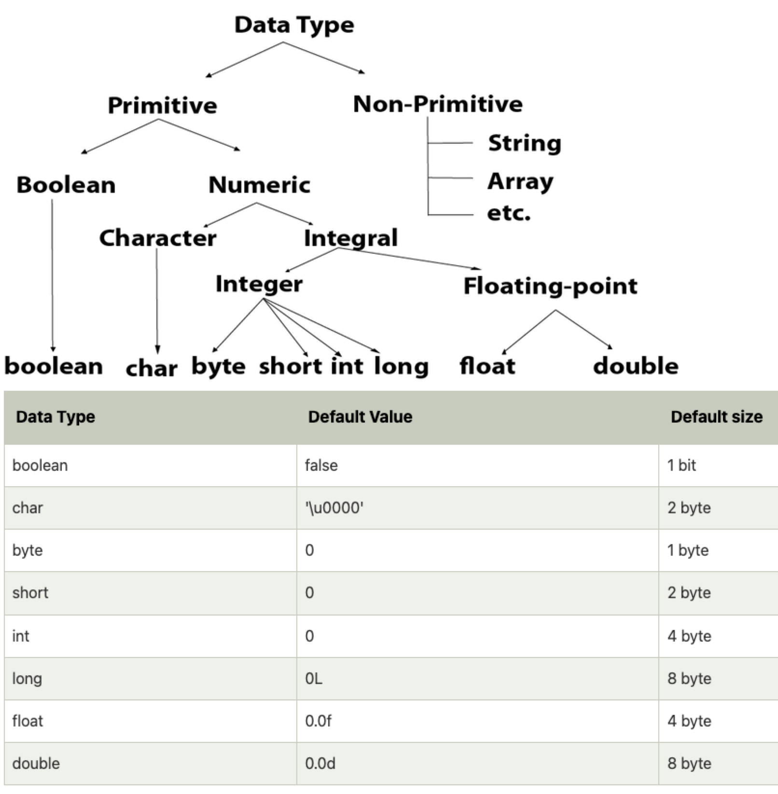

= Core Java - Notes
:toc: right
:toclevels: 5
:sectnums: 5


== Path Environment Variable

The `PATH` environment variable in Java (and more broadly in any operating system) is a system variable used to specify the directories in which executable programs are located. When you run a command in the terminal or command prompt, the operating system searches through these directories to find the executable file corresponding to the command.

*Importance of `PATH` in Java*

When working with Java, the `PATH` environment variable is crucial because it allows the system to locate the Java Development Kit (JDK) executables, such as `java` (the Java runtime) and `javac` (the Java compiler). By setting the `PATH` variable to include the directory where the JDK binaries are located, you can run Java commands from any command line prompt without needing to specify the full path to the executable.

*Setting the `PATH` Environment Variable*

*On Windows:*
1. *Locate JDK Installation Directory*:
- Typically, it is something like `C:\Program Files\Java\jdk-17\bin`.

2. *Set the PATH variable*:
- Open the *Start Menu* and search for `Environment Variables`.
- Click on *Edit the system environment variables*.
- In the System Properties window, click on the *Environment Variables* button.
- In the Environment Variables window, under *System variables*, find the `Path` variable and select it. Click on *Edit*.
- In the Edit Environment Variable dialog, click on *New* and add the path to the JDK `bin` directory (e.g., `C:\Program Files\Java\jdk-17\bin`).
- Click *OK* to close all dialog boxes.

---

*On macOS/Linux:*

1. *Locate JDK Installation Directory*:
- Typically, it is something like `/Library/Java/JavaVirtualMachines/jdk-17.jdk/Contents/Home/bin` on macOS or `/usr/lib/jvm/java-17-openjdk-amd64/bin` on Linux.

2. *Set the PATH variable*:
- Open a terminal.
- Open the `.bash_profile`, `.bashrc`, `.zshrc`, or `.profile` file in a text editor (depending on your shell and system configuration):
```sh
nano ~/.bash_profile
```
- Add the following line to set the PATH variable:
```sh
export PATH=$PATH:/Library/Java/JavaVirtualMachines/jdk-17.jdk/Contents/Home/bin
# or for Linux
export PATH=$PATH:/usr/lib/jvm/java-17-openjdk-amd64/bin
```
- Save the file and exit the text editor.
- Apply the changes by running:
```sh
source ~/.bash_profile
```

---

*Verifying the PATH*

To verify that the PATH variable is set correctly, you can open a new terminal or command prompt and run:
----
java -version
javac -version
----
If the PATH is set correctly, these commands should display the installed Java version without any errors.

== Data Types in Java



---


*Primitive Data Types*

1. *byte*:
- Example: `byte b = 100;`
- Range: -128 to 127

2. *short*:
- Example: `short s = 10000;`
- Range: -32,768 to 32,767

3. *int*:
- Example: `int i = 100000;`
- Range: -2^31 to 2^31-1

4. *long*:
- Example: `long l = 100000L;`
- Range: -2^63 to 2^63-1

5. *float*:
- Example: `float f = 234.5f;`
- Range: Approximately ±3.40282347E+38F (6-7 significant decimal digits)

6. *double*:
- Example: `double d = 123.4;`
- Range: Approximately ±1.79769313486231570E+308 (15 significant decimal digits)

7. *char*:
- Example: `char c = 'A';`
- Range: 0 to 65,535 (unsigned)

8. *boolean*:
- Example: `boolean b = true;`
- Values: `true` or `false`

[source, java]
----
public class PrimitiveDataTypes {
    public static void main(String[] args) {
        // byte example
        byte byteVar = 100;
        System.out.println("byte value: " + byteVar);

        // short example
        short shortVar = 10000;
        System.out.println("short value: " + shortVar);

        // int example
        int intVar = 100000;
        System.out.println("int value: " + intVar);

        // long example
        long longVar = 100000L;
        System.out.println("long value: " + longVar);

        // float example
        float floatVar = 234.5f;
        System.out.println("float value: " + floatVar);

        // double example
        double doubleVar = 123.4;
        System.out.println("double value: " + doubleVar);

        // char example
        char charVar = 'A';
        System.out.println("char value: " + charVar);

        // boolean example
        boolean booleanVar = true;
        System.out.println("boolean value: " + booleanVar);
    }
}

----


== Unicode

[source, java]
----
public class UnicodeExample {
    public static void main(String[] args) {
        // Initializing Unicode characters using their code points
        char letterA = '\u0041'; // Unicode for 'A'
        char letterB = '\u0042'; // Unicode for 'B'
        char smileyFace = '\u263A'; // Unicode for '☺'

        // Printing Unicode characters
        System.out.println("Unicode Character \\u0041: " + letterA);
        System.out.println("Unicode Character \\u0042: " + letterB);
        System.out.println("Unicode Character \\u263A: " + smileyFace);

        // Printing Unicode code points
        System.out.println("Code Point of " + letterA + ": " + (int) letterA);
        System.out.println("Code Point of " + letterB + ": " + (int) letterB);
        System.out.println("Code Point of " + smileyFace + ": " + (int) smileyFace);

        // Using Unicode characters in strings
        String greeting = "Hello " + letterA + letterB + smileyFace + "!";
        System.out.println(greeting);

        // Unicode characters in a loop
        System.out.println("Looping through Unicode characters:");
        for (char ch = '\u0041'; ch <= '\u0045'; ch++) {
            System.out.println("Unicode Character: " + ch + " Code Point: " + (int) ch);
        }
    }
}

----

---

*Non-Primitive Data Types*

1. *String*:
- Example: `String str = "Hello, World!";`
- Strings are sequences of characters.

2. *Array*:
- Example: `int[] arr = {1, 2, 3, 4, 5};`
- Arrays can hold multiple values of the same type.

3. *Class*:

4. *Interface*:

5. *Enum*:

== Variables in Java

In Java, a variable is a container that holds data that can be changed during the execution of a program. Variables are fundamental to Java programming and are used to store information that your Java program manipulates. Each variable in Java has a specific type, which determines the size and layout of the variable's memory, the range of values that can be stored within that memory, and the set of operations that can be applied to the variable.

*Types of Variables in Java*

1. *Local Variables*:
- Declared inside a method, constructor, or block.
- Scope is limited to the block in which they are declared.
- Must be initialized before use.

2. *Instance Variables* (Non-static Fields):
- Declared inside a class but outside any method.
- Each instance of the class has its own copy of the variable.
- Initialized to default values if not explicitly initialized.

3. *Class Variables* (Static Fields):
- Declared with the `static` keyword inside a class but outside any method.
- Shared among all instances of the class.
- Initialized to default values if not explicitly initialized.


Here is an example illustrating different types of variables:

[source, java]
----
public class VariablesExample {
    // Instance variable
    int instanceVar;

    // Class variable (static variable)
    static int staticVar;

    public void methodExample() {
        // Local variable
        int localVar = 10;

        System.out.println("Local variable: " + localVar);
        System.out.println("Instance variable: " + instanceVar);
        System.out.println("Static variable: " + staticVar);
    }

    public static void main(String[] args) {
        // Create an instance of VariablesExample
        VariablesExample example = new VariablesExample();

        // Access instance variable
        example.instanceVar = 5;

        // Access static variable
        VariablesExample.staticVar = 20;

        // Call method to demonstrate local variable
        example.methodExample();
    }
}
----

################################################################################

== Operators in Java

In Java, operators are special symbols that perform specific operations on one, two, or three operands, and then return a result. Here are the different types of operators in Java:

*1. Arithmetic Operators*

Used for performing basic arithmetic operations.

[source,java]
----
public class ArithmeticOperatorsDemo {
    public static void main(String[] args) {
        // Define variables
        int a = 15;
        int b = 4;

        // Addition
        int addition = a + b;
        System.out.println("Addition: " + a + " + " + b + " = " + addition);

        // Subtraction
        int subtraction = a - b;
        System.out.println("Subtraction: " + a + " - " + b + " = " + subtraction);

        // Multiplication
        int multiplication = a * b;
        System.out.println("Multiplication: " + a + " * " + b + " = " + multiplication);

        // Division
        int division = a / b;
        System.out.println("Division: " + a + " / " + b + " = " + division);

        // Modulus
        int modulus = a % b;
        System.out.println("Modulus: " + a + " % " + b + " = " + modulus);

        // Handling division by zero
        int zeroDivisor = 0;
        try {
            int result = a / zeroDivisor;
            System.out.println("Division by zero: " + result);
        } catch (ArithmeticException e) {
            System.out.println("Error: Division by zero is not allowed.");
        }
    }
}
----

################################################################################

---

*2. Unary Operators*

Used with only one operand.

[source,java]
----
public class UnaryOperatorsDemo {
    public static void main(String[] args) {
        // Initialize variables
        int a = 10;
        int b = -5;
        boolean flag = true;

        // Unary Plus
        int unaryPlus = +a;
        System.out.println("Unary Plus: " + unaryPlus);

        // Unary Minus
        int unaryMinus = -b;
        System.out.println("Unary Minus: " + unaryMinus);

        // Increment (Pre and Post)
        System.out.println("Pre-Increment: " + (++a));
        System.out.println("Post-Increment: " + (a++));

        // Decrement (Pre and Post)
        System.out.println("Pre-Decrement: " + (--b));
        System.out.println("Post-Decrement: " + (b--));

        // Logical NOT
        boolean notFlag = !flag;
        System.out.println("Logical NOT: " + notFlag);
    }
}

----

################################################################################

---

*3. Assignment Operators*
Used to assign values to variables.

[source,java]
----
public class AssignmentOperatorsDemo {
    public static void main(String[] args) {
        int a = 10;
        int b = 5;

        // Simple assignment
        int c = a;
        System.out.println("Simple assignment: c = " + c);

        // Addition assignment
        c += b;
        System.out.println("Addition assignment: c += b -> c = " + c);

        // Subtraction assignment
        c -= b;
        System.out.println("Subtraction assignment: c -= b -> c = " + c);

        // Multiplication assignment
        c *= b;
        System.out.println("Multiplication assignment: c *= b -> c = " + c);

        // Division assignment
        c /= b;
        System.out.println("Division assignment: c /= b -> c = " + c);

        // Modulus assignment
        c %= b;
        System.out.println("Modulus assignment: c %= b -> c = " + c);
    }
}

----


################################################################################

---

*4. Relational Operators*
Used to compare two values.

[source,java]
----
public class RelationalOperatorsDemo {
    public static void main(String[] args) {
        int a = 10;
        int b = 5;
        int c = 10;

        // Equal to
        System.out.println("a == b: " + (a == b));
        System.out.println("a == c: " + (a == c));

        // Not equal to
        System.out.println("a != b: " + (a != b));
        System.out.println("a != c: " + (a != c));

        // Greater than
        System.out.println("a > b: " + (a > b));
        System.out.println("a > c: " + (a > c));

        // Less than
        System.out.println("a < b: " + (a < b));
        System.out.println("a < c: " + (a < c));

        // Greater than or equal to
        System.out.println("a >= b: " + (a >= b));
        System.out.println("a >= c: " + (a >= c));

        // Less than or equal to
        System.out.println("a <= b: " + (a <= b));
        System.out.println("a <= c: " + (a <= c));
    }
}

----


################################################################################

---

*5. Logical Operators*
Used to perform logical operations on boolean expressions.


[source,java]
----
public class LogicalOperatorsDemo {
    public static void main(String[] args) {
        boolean a = true;
        boolean b = false;

        // Logical AND
        System.out.println("a && b: " + (a && b));

        // Logical OR
        System.out.println("a || b: " + (a || b));

        // Logical NOT
        System.out.println("!a: " + (!a));
        System.out.println("!b: " + (!b));
    }
}
----


################################################################################

---

*6. Ternary Operator*
Also known as the conditional operator, it is used to decide which value to assign to a variable based on a boolean condition.

[source,java]
----
public class TernaryOperatorDemo {
    public static void main(String[] args) {
        int a = 10;
        int b = 5;

        // Ternary operator
        int max = (a > b) ? a : b;
        System.out.println("Max of a and b: " + max);

        int min = (a < b) ? a : b;
        System.out.println("Min of a and b: " + min);

        boolean isEqual = (a == b) ? true : false;
        System.out.println("a equals b: " + isEqual);
    }
}

----

== If, Else

`if-else if` statements in Java are used to execute specific blocks of code based on multiple conditions. They are commonly used for:

1. *Decision Making:* To make decisions and perform actions based on different conditions.
2. *Validations:* To check and validate user inputs or data.
3. *Branching Logic:* To handle different scenarios in code execution, such as in algorithms or business logic.

[source,java]
----
public class Main {
    public static void main(String[] args) {
        int number = 10;

        if (number > 0) {
            System.out.println("The number is positive.");
        } else if (number < 0) {
            System.out.println("The number is negative.");
        } else {
            System.out.println("The number is zero.");
        }
    }
}
----

== Switch Case

[source, java]
----
public class Main {
    public static void main(String[] args) {
        int day = 3;
        String dayName;

        switch (day) {
            case 1:
                dayName = "Monday";
                break;
            case 2:
                dayName = "Tuesday";
                break;
            case 3:
                dayName = "Wednesday";
                break;
            case 4:
                dayName = "Thursday";
                break;
            case 5:
                dayName = "Friday";
                break;
            case 6:
                dayName = "Saturday";
                break;
            case 7:
                dayName = "Sunday";
                break;
            default:
                dayName = "Invalid day";
                break;
        }

        System.out.println("The day is: " + dayName);
    }
}

----

=== Switch Case V/s If Else

Choosing between `switch-case` and `if-else` in Java depends on the specific use case and the nature of the conditions you need to evaluate. Here are some guidelines to help decide when to use each:

*Use `switch-case` When:*

1. *Multiple Discrete Values:*
- You have a variable that you need to compare against several discrete constant values (e.g., integers, enums, characters, or strings).
- Example: Days of the week, menu options, or status codes.

2. *Readability and Maintainability:*
- The code becomes more readable and maintainable when dealing with many possible values.
- `switch-case` provides a cleaner and more organized structure for handling multiple branches.

3. *Performance:*
- `switch-case` can be more efficient than `if-else` when there are many branches because it can use a jump table for constant values, whereas `if-else` evaluates conditions sequentially.

*Use `if-else` When:*
1. *Range of Values:*
- You need to evaluate conditions based on ranges or complex logical expressions.
- Example: Checking if a number is within a certain range or combining multiple conditions.

2. *Boolean Conditions:*
- Your conditions are boolean expressions that do not compare against discrete constant values.
- Example: Checking conditions like `x > 10 && y < 5`.

3. *Complex Conditions:*
- You have complex conditions that cannot be simplified to discrete values.
- Example: Conditions involving multiple variables and logical operators.

*Examples:*


[source,java]
----
public class Main {
    public static void main(String[] args) {
int option = 2;

switch (option) {
    case 1:
        System.out.println("Option 1 selected");
        break;
    case 2:
        System.out.println("Option 2 selected");
        break;
    case 3:
        System.out.println("Option 3 selected");
        break;
    default:
        System.out.println("Invalid option");
        break;
    }
}
}
----


[source,java]
----

public class Main {
    public static void main(String[] args) {


int number = 45;

if (number > 0 && number <= 10) {
    System.out.println("Number is between 1 and 10");
} else if (number > 10 && number <= 20) {
    System.out.println("Number is between 11 and 20");
} else if (number > 20 && number <= 30) {
    System.out.println("Number is between 21 and 30");
} else {
    System.out.println("Number is out of range");
}
}
}
----

In summary, use `switch-case` for comparing a single variable against multiple constant values for better readability and potential performance benefits. Use `if-else` for complex conditions, ranges, or when boolean expressions are involved.


=== For, While and Do While Loop

== Java Loops

=== For Loop

[source, java]
----
public class Main {
    public static void main(String[] args) {
        for (int i = 0; i < 5; i++) {
            System.out.println("i = " + i);
        }
    }
}
----

This code demonstrates a `for` loop in Java. It initializes an integer `i` to 0, checks if `i` is less than 5, and increments `i` by 1 after each iteration. The loop prints the value of `i` during each iteration.

=== While Loop

[source, java]
----
public class Main {
    public static void main(String[] args) {
        int i = 0;
        while (i < 5) {
            System.out.println("i = " + i);
            i++;
        }
    }
}
----

This code demonstrates a `while` loop in Java. It initializes an integer `i` to 0 and continues looping as long as `i` is less than 5. The loop prints the value of `i` and then increments `i` by 1 during each iteration.

=== Do-While Loop

[source, java]
----
public class Main {
    public static void main(String[] args) {
        int i = 0;
        do {
            System.out.println("i = " + i);
            i++;
        } while (i < 5);
    }
}
----

This code demonstrates a `do-while` loop in Java. It initializes an integer `i` to 0 and executes the loop body at least once, regardless of the condition. The loop prints the value of `i` and then increments `i` by 1. After the loop body, it checks if `i` is less than 5 before repeating.


== OOPs Programming


=== Methods in Java

Methods in Java are blocks of code that perform a specific task and can be called upon to execute that task. Methods help in reusing code and organizing the program into smaller, manageable sections. A method typically includes a name, a return type, parameters (if any), and a body.

[source, java]
----
public class Calculator {
    // Method to add two numbers
    public int add(int a, int b) {
        return a + b;
    }

    // Method to subtract two numbers
    public int subtract(int a, int b) {
        return a - b;
    }

    // Method to multiply two numbers
    public int multiply(int a, int b) {
        return a * b;
    }

    // Method to divide two numbers
    public double divide(int a, int b) {
        if (b != 0) {
            return (double) a / b;
        } else {
            System.out.println("Division by zero is not allowed.");
            return 0;
        }
    }
}
----

This code defines a `Calculator` class with four methods: `add`, `subtract`, `multiply`, and `divide`. Each method performs a basic arithmetic operation.

*Using Methods*

[source, java]
----
public class Main {
    public static void main(String[] args) {
        // Creating an object of the Calculator class
        Calculator calculator = new Calculator();

        // Calling methods on the calculator object
        int sum = calculator.add(10, 5);
        int difference = calculator.subtract(10, 5);
        int product = calculator.multiply(10, 5);
        double quotient = calculator.divide(10, 5);

        // Printing the results
        System.out.println("Sum: " + sum);
        System.out.println("Difference: " + difference);
        System.out.println("Product: " + product);
        System.out.println("Quotient: " + quotient);
    }
}
----

In this code, we create an object `calculator` of the `Calculator` class and call its methods (`add`, `subtract`, `multiply`, and `divide`) to perform arithmetic operations. The results are then printed to the console.

*Explanation*

* *Method Definition*: A method is defined within a class and includes the method's return type, name, parameters, and body.
* *Return Type*: Specifies the type of value the method returns. If the method does not return any value, the return type is `void`.
* *Method Name*: A unique identifier for the method, used to call the method.
* *Parameters*: Inputs to the method, enclosed in parentheses. Methods can have zero or more parameters.
* *Method Body*: The block of code that defines what the method does. Enclosed in curly braces `{}`.
* *Calling a Method*: To execute a method, we create an object of the class containing the method and call the method using the object.

##############################################

*Method Calling*

[source, java]
----
public class Main {
    public static void main(String[] args) {
        Main mainObj = new Main();
        mainObj.greet("Alice");
    }

    // Method to greet a person
    public void greet(String name) {
        System.out.println("Hello, " + name + "!");
    }
}
----


=== Method Overloading in Java

Method overloading in Java allows a class to have more than one method with the same name, but different parameters. These methods can have different numbers of parameters or different types of parameters. The main advantage of method overloading is that it increases the readability of the program.

*Method Overloading Example*

[source, java]
----
public class MathOperations {
    // Method to add two integers
    public int add(int a, int b) {
        return a + b;
    }

    // Overloaded method to add three integers
    public int add(int a, int b, int c) {
        return a + b + c;
    }

    // Overloaded method to add two double values
    public double add(double a, double b) {
        return a + b;
    }
}
----

This code defines a `MathOperations` class with three overloaded `add` methods:

* The first method adds two integers.
* The second method adds three integers.
* The third method adds two double values.

*Using Overloaded Methods*

[source, java]
----
public class Main {
    public static void main(String[] args) {
        // Creating an object of the MathOperations class
        MathOperations math = new MathOperations();

        // Calling the overloaded add methods
        int sum1 = math.add(5, 10);          // Calls the first add method
        int sum2 = math.add(5, 10, 15);      // Calls the second add method
        double sum3 = math.add(5.5, 10.5);   // Calls the third add method

        // Printing the results
        System.out.println("Sum1: " + sum1);
        System.out.println("Sum2: " + sum2);
        System.out.println("Sum3: " + sum3);
    }
}
----

In this code, we create an object `math` of the `MathOperations` class and call the overloaded `add` methods. Each call to the `add` method resolves to the appropriate method based on the number and type of arguments passed.

*Explanation*

* *Method Overloading*: Allows a class to have multiple methods with the same name but different parameters.
* *Different Parameters*: Methods can differ in the number of parameters or the types of parameters.
* *First add Method*: Takes two integers as parameters and returns their sum.
* *Second add Method*: Takes three integers as parameters and returns their sum.
* *Third add Method*: Takes two double values as parameters and returns their sum.
* *Calling Overloaded Methods*: When calling an overloaded method, Java determines which method to invoke based on the arguments passed.


##############################################

=== Classes and Objects in Java

In Java, a class is a blueprint for creating objects. A class defines the properties (attributes) and behaviors (methods) that the objects created from the class can have. An object is an instance of a class.

*Class Definition*

[source, java]
----
public class Car {
    // Attributes (properties)
    String color;
    String model;
    int year;

    // Constructor
    public Car(String color, String model, int year) {
        this.color = color;
        this.model = model;
        this.year = year;
    }

    // Method (behavior)
    public void displayDetails() {
        System.out.println("Color: " + color);
        System.out.println("Model: " + model);
        System.out.println("Year: " + year);
    }
}
----

This code defines a `Car` class with three attributes: `color`, `model`, and `year`. It includes a constructor to initialize these attributes and a method `displayDetails` to print the car's details.

*Creating Objects*

[source, java]
----
public class Main {
    public static void main(String[] args) {
        // Creating an object of the Car class
        Car car1 = new Car("Red", "Toyota", 2021);

        // Accessing object methods
        car1.displayDetails();
    }
}
----

In this code, we create an object `car1` of the `Car` class by calling the constructor with specific values for `color`, `model`, and `year`. We then call the `displayDetails` method on the `car1` object to print its details.

*Explanation*

* *Class*: The `Car` class is a blueprint that defines what a car object should have (attributes) and what it can do (methods).
* *Attributes*: `color`, `model`, and `year` are properties of the `Car` class.
* *Constructor*: The `Car` constructor initializes the attributes when a new car object is created.
* *Method*: `displayDetails` is a behavior that prints the car's details.
* *Object*: `car1` is an instance of the `Car` class with specific values for its attributes.


##############################################

=== Constructors in Java

A constructor in Java is a special method used to initialize objects. It is called when an object of a class is created. Constructors have the same name as the class and do not have a return type.

*Constructor Definition*

[source, java]
----
public class Car {
    // Attributes (properties)
    String color;
    String model;
    int year;

    // Constructor
    public Car(String color, String model, int year) {
        this.color = color;
        this.model = model;
        this.year = year;
    }

    // Method to display car details
    public void displayDetails() {
        System.out.println("Color: " + color);
        System.out.println("Model: " + model);
        System.out.println("Year: " + year);
    }
}
----

This code defines a `Car` class with three attributes: `color`, `model`, and `year`. It includes a constructor to initialize these attributes and a method `displayDetails` to print the car's details.

*Using Constructors*

[source, java]
----
public class Main {
    public static void main(String[] args) {
        // Creating an object of the Car class using the constructor
        Car car1 = new Car("Red", "Toyota", 2021);

        // Accessing object methods
        car1.displayDetails();
    }
}
----

In this code, we create an object `car1` of the `Car` class by calling the constructor with specific values for `color`, `model`, and `year`. We then call the `displayDetails` method on the `car1` object to print its details.

*Explanation*

* *Constructor*: A special method used to initialize objects. It has the same name as the class and no return type.
* *Attributes*: Properties of the class, such as `color`, `model`, and `year` in the `Car` class.
* *Initializing Attributes*: The constructor initializes the attributes when a new object is created.
* *Creating Objects*: When creating an object, the constructor is called with the specified parameters to initialize the object's attributes.
* *Calling Methods*: After creating an object, you can call its methods to perform actions, such as displaying details.

=== Encapsulation

=== Polymorphism

=== Abstraction

=== Inheritance

=== Classes V/s Interfaces

=== this keyword


##############################################

== Strings in Java

A string in Java is a sequence of characters. Strings are used to store and manipulate text. They are objects of the `String` class, which is part of the `java.lang` package. In Java, strings are immutable, meaning that once a string is created, its value cannot be changed.

*Creating Strings*

There are several ways to create strings in Java:

[source, java]
----
public class Main {
    public static void main(String[] args) {
        // Creating strings using string literals
        String str1 = "Hello, World!";
        
        // Creating strings using the new keyword
        String str2 = new String("Hello, World!");


        // Displaying the strings
        System.out.println(str1);  // Output: Hello, World!
        System.out.println(str2);  // Output: Hello, World!
    }
}
----

*String Methods*

The `String` class provides various methods for manipulating strings. Here are some commonly used methods:

[source, java]
----
public class Main {
    public static void main(String[] args) {
        String str = "Hello, World!";

        // Length of the string
        int length = str.length();
        System.out.println("Length: " + length);  // Output: 13

        // Convert to uppercase
        String upperStr = str.toUpperCase();
        System.out.println("Uppercase: " + upperStr);  // Output: HELLO, WORLD!

        // Convert to lowercase
        String lowerStr = str.toLowerCase();
        System.out.println("Lowercase: " + lowerStr);  // Output: hello, world!

        // Substring
        String subStr = str.substring(7);
        System.out.println("Substring: " + subStr);  // Output: World!

        // Replace
        String replacedStr = str.replace("World", "Java");
        System.out.println("Replaced: " + replacedStr);  // Output: Hello, Java!

        // Concatenation
        String concatStr = str.concat(" How are you?");
        System.out.println("Concatenated: " + concatStr);  // Output: Hello, World! How are you?

        // Check equality
        boolean isEqual = str.equals("Hello, World!");
        System.out.println("Is Equal: " + isEqual);  // Output: true
    }
}
----

##############################################

== StringBuffer in Java

`StringBuffer` is a thread-safe, mutable sequence of characters. Unlike `String`, which is immutable, `StringBuffer` can be modified after it is created. This makes it a useful class for manipulating strings in a way that avoids creating many intermediate `String` objects.

=== Creating a StringBuffer

A `StringBuffer` can be created in several ways:

[source, java]
----
public class Main {
    public static void main(String[] args) {
        // Creating a StringBuffer with an initial capacity of 16 characters
        StringBuffer buffer1 = new StringBuffer();

        // Creating a StringBuffer with a specified initial capacity
        StringBuffer buffer2 = new StringBuffer(50);

        // Creating a StringBuffer with an initial string
        StringBuffer buffer3 = new StringBuffer("Hello, World!");

        // Appending text to a StringBuffer
        buffer3.append(" How are you?");
        System.out.println(buffer3);  // Output: Hello, World! How are you?

        // Inserting text into a StringBuffer
        buffer3.insert(13, " Java");
        System.out.println(buffer3);  // Output: Hello, World! Java How are you?

        // Reversing the contents of a StringBuffer
        buffer3.reverse();
        System.out.println(buffer3);  // Output: ?uoy era woH avaJ !dlroW ,olleH

        // Deleting a part of the StringBuffer
        buffer3.delete(0, 6);
        System.out.println(buffer3);  // Output: era woH avaJ !dlroW ,olleH

        // Replacing part of the StringBuffer
        buffer3.replace(4, 7, "are you");
        System.out.println(buffer3);  // Output: era are you avaJ !dlroW ,olleH

        // Converting StringBuffer to String
        String str = buffer3.toString();
        System.out.println(str);  // Output: era are you avaJ !dlroW ,olleH
    }
}
----


##############################################

== Arrays in Java

An array in Java is a container object that holds a fixed number of values of a single type. The length of an array is established when the array is created, and after creation, its length is fixed.

*Creating Arrays*

Arrays can be created and initialized in several ways:

[source, java]
----
public class Main {
    public static void main(String[] args) {
        // Declaring and initializing an array of integers
        int[] numbers = {1, 2, 3, 4, 5};

        // Declaring an array and then allocating memory for it
        String[] fruits = new String[3];
        fruits[0] = "Apple";
        fruits[1] = "Banana";
        fruits[2] = "Cherry";

        // Accessing array elements
        System.out.println("First number: " + numbers[0]);  // Output: 1
        System.out.println("First fruit: " + fruits[0]);    // Output: Apple

        // Length of an array
        System.out.println("Length of numbers array: " + numbers.length);  // Output: 5
        System.out.println("Length of fruits array: " + fruits.length);    // Output: 3

        // Iterating over an array using a for loop
        System.out.print("Numbers: ");
        for (int i = 0; i < numbers.length; i++) {
            System.out.print(numbers[i] + " ");
        }
        System.out.println();

        // Iterating over an array using a for-each loop
        System.out.print("Fruits: ");
        for (String fruit : fruits) {
            System.out.print(fruit + " ");
        }
        System.out.println();
    }
}
----

##############################################

== Access Modifier in Java

##############################################

== Static Keyword in Java

##############################################

== Packages in Java

##############################################

== Collections in Java

=== List 

=== Set

=== Map

##############################################

== MultiThreading Concepts

##############################################

== Excrption Handling

##############################################

##############################################

== OOPs Question Set

*Question 1*

Which of the following is the correct way to define a method in Java that returns an integer and takes two integer parameters?

A. `public void add(int a, int b) { return a + b; }`

B. `public int add(int a, int b) { return a + b; }`

C. `public int add(int a, int b) { return a.add(b); }`

D. `public void add(int a, int b) { return a + b; }`

.Click Here For Answer
[%collapsible]
====
The answer is B
====

*Question 2*

What is method overloading in Java?

A. Defining multiple methods in a class with the same name and same parameters.

B. Defining multiple methods in a class with different names and different parameters.

C. Defining multiple methods in a class with the same name but different parameters.

D. Defining multiple methods in a class with the same name and the same return type.

.Click Here For Answer
[%collapsible]
====
The answer is C
====

*Question 3*

Which statement is true about passing arguments to methods in Java?

A. Arguments are always passed by reference.

B. Arguments are always passed by value.

C. Primitive data types are passed by value, and objects are passed by reference.

D. Primitive data types are passed by reference, and objects are passed by value.

.Click Here For Answer
[%collapsible]
====
The answer is B
====

*Question 4*

What is the return type of a method that does not return any value?

A. `int`

B. `void`

C. `null`

D. `None`

.Click Here For Answer
[%collapsible]
====
The answer is B
====

##############################################

== Question Set 1 (JDK, JRE, ENV Variables)


Sure! Here are five multiple-choice questions for beginners on PATH, CLASSPATH, environment variables, bytecode, JDK, and JRE:

1. *What does the PATH environment variable do?*
- A) Specifies the maximum memory allocation for the operating system.
- B) Stores the location of executables to be used from the command line.
- C) Defines the network configuration settings.
- D) Sets the default file permissions.

2. *What is the primary purpose of the CLASSPATH environment variable in Java?*
- A) To specify the maximum heap size for Java applications.
- B) To locate the Java Development Kit (JDK).
- C) To locate the classes and libraries required by Java programs.
- D) To store the user’s personal settings for Java applications.

3. *Which of the following statements about bytecode is correct?*
- A) Bytecode is the machine code for the Java Virtual Machine (JVM).
- B) Bytecode is the source code written by the programmer.
- C) Bytecode is the binary code executed directly by the operating system.
- D) Bytecode is used only for JavaScript programs.

4. *What is included in the Java Development Kit (JDK)?*
- A) Only the Java Runtime Environment (JRE).
- B) The JRE, development tools, and libraries for Java development.
- C) Only the Java Virtual Machine (JVM).
- D) Only the Java API documentation.

5. *What is the role of the Java Runtime Environment (JRE)?*
- A) To compile Java source code into bytecode.
- B) To provide libraries, Java Virtual Machine (JVM), and other components to run Java applications.
- C) To develop and debug Java applications.
- D) To edit Java source code files.

== Question Set 2 (Data Types, Variables)


*Question 1: Java Data Types*

*Which of the following is not a primitive data type in Java?*

A. int

B. boolean

C. String

D. char

*Question 2: Unicode in Java*

*What is the range of Unicode values in Java?*

A. 0 to 65535

B. 0 to 32767

C. 0 to 2147483647

D. 0 to 1114111

*Question 3: Variables in Java*

*Which of the following statements is correct about variable declaration and initialization in Java?*

A. int a; a = 5;

B. int a = 5;

C. a = 5; int a;

D. Both A and B

*Question 4: Operators in Java*

*What will be the output of the following code?*

[source,java]
----

public class Main {
    public static void main(String[] args) {
    int a = 10;
    int b = 5;
    System.out.println(a / b);
    }
}

----

A. 0

B. 2

C. 2.0

D. 10.0


*Question 5: Java Data Types*

*Which of the following statements is true about the `char` data type in Java?*

A. It is a 16-bit signed integer.

B. It is a 32-bit unsigned integer.

C. It is a 16-bit unsigned integer.

D. It is a 32-bit signed integer.

== Coding Exercises


### Coding Exercise: Data Types and Variables

*Objective:*

The goal of this exercise is to test your understanding of Java data types, including both primitive and reference types, and your ability to work with variables.

*Problem Statement:*

1. *Primitive Data Types*
- Create a Java class named `PrimitiveDataTypes`.
- Declare variables of the following primitive data types: `int`, `double`, `char`, and `boolean`.
- Assign appropriate values to each variable.
- Write a method `displayPrimitives()` that prints the values of these variables to the console.

2. *Reference Data Types*
- Create a Java class named `ReferenceDataTypes`.
- Declare variables of the following reference data types: `String`, `Array`, and a custom class type `Person` (which you will define).
- Assign appropriate values to each variable.
- Write a method `displayReferences()` that prints the values of these variables to the console.

3. *Custom Class: Person*
- Create a custom class named `Person` with the following attributes: `name` (String), `age` (int).
- Include a constructor to initialize these attributes.
- Override the `toString()` method to provide a string representation of a `Person` object.

*Instructions:*

*Task:*

1. Implement the classes `PrimitiveDataTypes`, `Person`, and `ReferenceDataTypes` as described above.
2. Compile and run the `PrimitiveDataTypes` and `ReferenceDataTypes` classes to ensure they work as expected.
3. Ensure that all the values are printed correctly to the console.

---

This exercise will help you demonstrate your understanding of both primitive and reference data types in Java, along with basic object-oriented programming concepts.

=== Coding Exercise: Conditional and Looping Statements

*Objective*

The goal of this exercise is to test your understanding of Java conditional statements (`if-else`, `switch`) and looping statements (`for`, `while`, `do-while`).

*Problem Statement:*

1. *Conditional Statements*

- Create a Java class named `ConditionalStatements`.
- Implement a method `checkNumber(int number)` that:
- Uses an `if-else` statement to check if the number is positive, negative, or zero and prints the result.
- Uses a `switch` statement to check if the number is 1, 2, 3, or another value and prints a corresponding message.

2. *Looping Statements*

- Create a Java class named `LoopingStatements`.
- Implement the following methods:
- `printNumbersForLoop(int n)`: Uses a `for` loop to print numbers from 1 to `n`.
- `printNumbersWhileLoop(int n)`: Uses a `while` loop to print numbers from 1 to `n`.
- `printNumbersDoWhileLoop(int n)`: Uses a `do-while` loop to print numbers from 1 to `n`.


*Task:*

1. Implement the classes `ConditionalStatements` and `LoopingStatements` as described above.
2. Compile and run the `ConditionalStatements` and `LoopingStatements` classes to ensure they work as expected.
3. Ensure that the appropriate messages and numbers are printed to the console.

---

This exercise will help you demonstrate your understanding of conditional and looping statements in Java.


== References

* https://www.youtube.com/watch?v=Qtua8t20dA4
* 